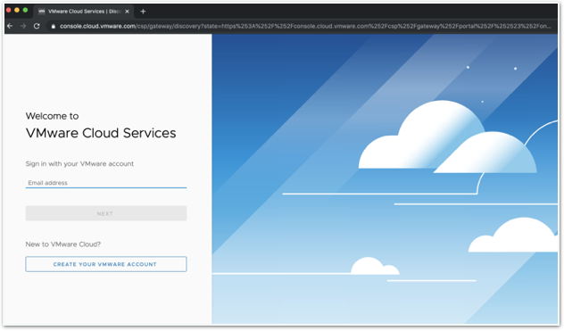
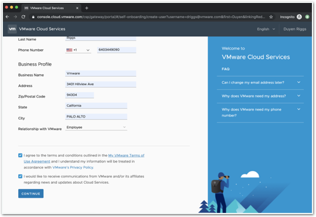
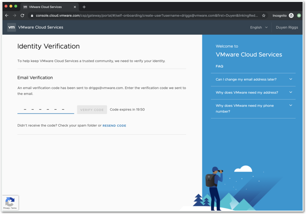
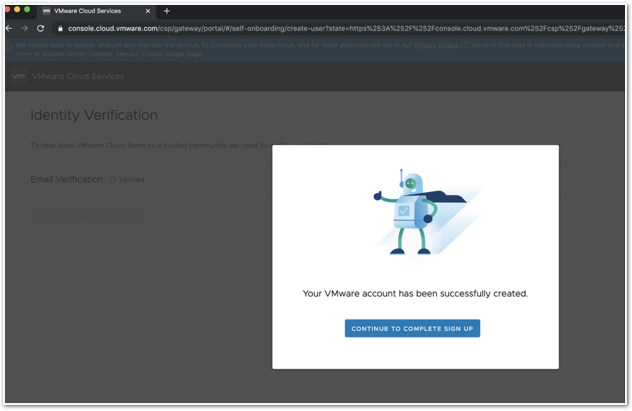
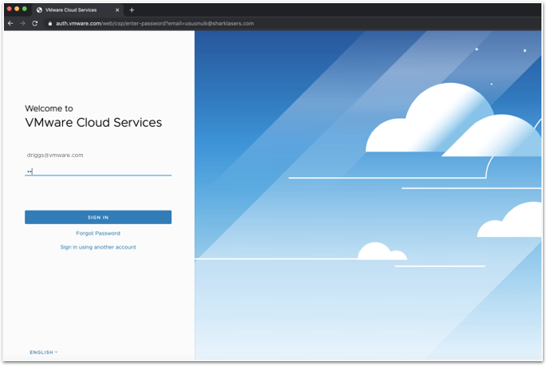
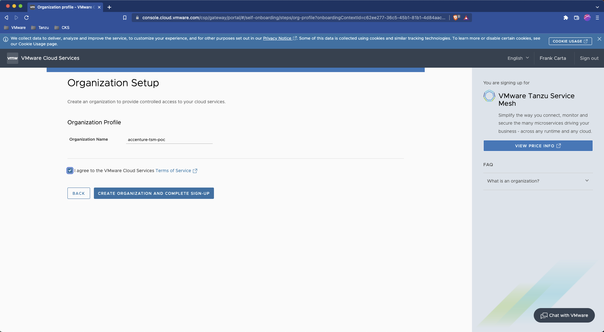
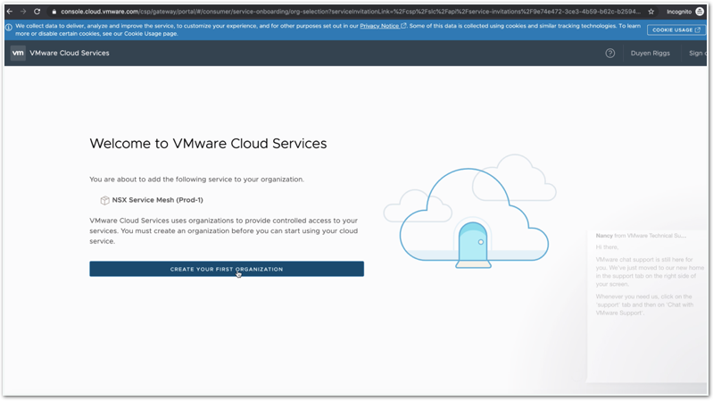
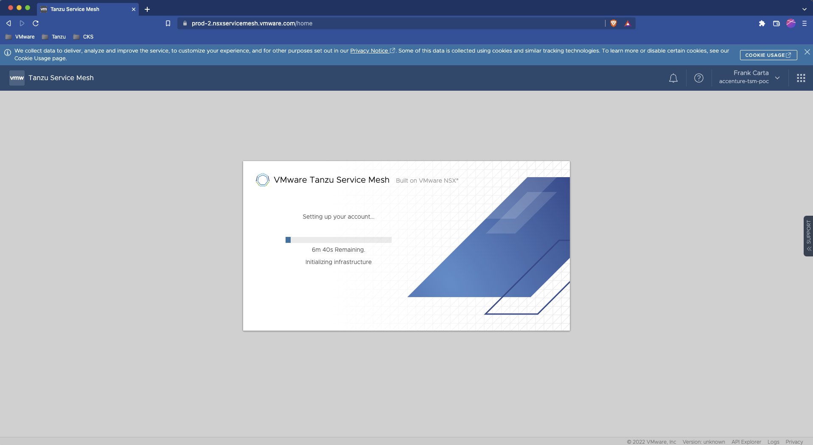
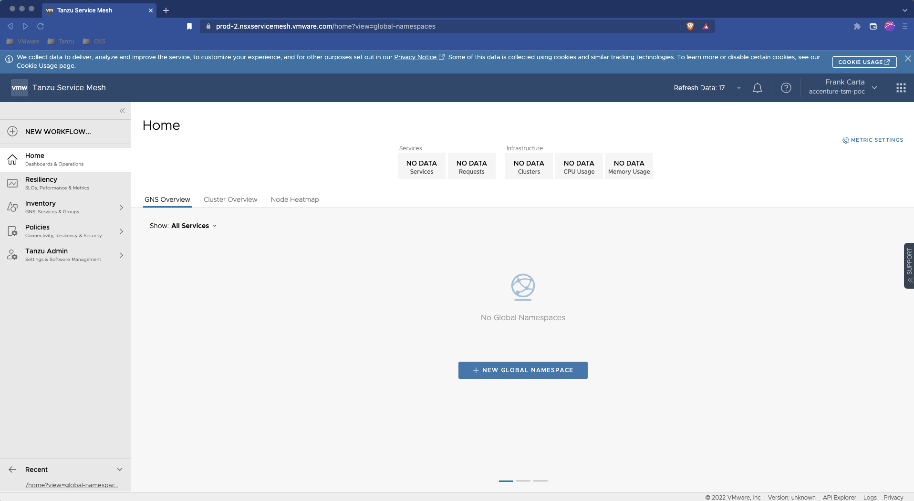

# SC01-TC01: Environment Setup & Validation - Validate TSM console accessible

This scenario is designed to help validate the onboarding workflow and the current testing environment is setup properly and ready for VMware Cloud Services Portal (CSP) and Tanzu Service Mesh (TSM) test cases.

---

## Test Case Summary

This test case procedure walks through the on-boarding workflow when you are invited via the VMware Cloud Service Portal (CSP) Service Mesh invite link and validates access to the CSP and the Tanzu Service Mesh (TSM) consoles.

---

## Prerequisites

* Adherance to [Tanzu Service Mesh Environment Requirements and Supported Platforms](https://docs.vmware.com/en/VMware-Tanzu-Service-Mesh/services/tanzu-service-mesh-environment-requirements-and-supported-platforms/GUID-D0B939BE-474E-4075-9A65-3D72B5B9F237.html#supported-platforms-1)

---

## Test Procedure

1. Start the Onboarding Process by clicking on CSP Service Mesh Invitation link or copy and paste the invitation link to a Chrome Browser. We will send this link to you and it will look something like this:

    Invitation Link: <https://console.cloud.vmware.com/csp/gateway/portal/api/service-invitations?serviceInvitationLink=/csp/slc/api/service-invitations/12a1b309-xxxx-xxxx-xxxx-xxxxxxxxxxxx>

    Then click on Create a New Organization Account found on the Cloud Services Page.
    

2. Complete the form with the company details and click on Continue
    

3. Finish the registration and identity verification setup
    

4. Click on Continue to Complete Sign up to login to the service.
    

5. Login to the new service
    

6. Click on Create Your First Organization. Accept all default settings, VMware Terms and Conditions prompts and click Continue.
    For a new Organization
    
    For an existing Organization
    

7. Once you log in, you will be directed to Tanzu Service Mesh. Tanzu Service Mesh sets up your account. During this process, a Tenant gets provisioned on the SaaS and service mesh services are deployed. This operation takes a couple of minutes.
    

8. After the account setup is completed, the Onboard Clusters modal is displayed where you will onboard a cluster.
    

---

## Status Pass/Fail

* [  ] Pass
* [  ] Fail

Return to [Test Cases Inventory](../../README.md###Test-Cases-Inventory)
