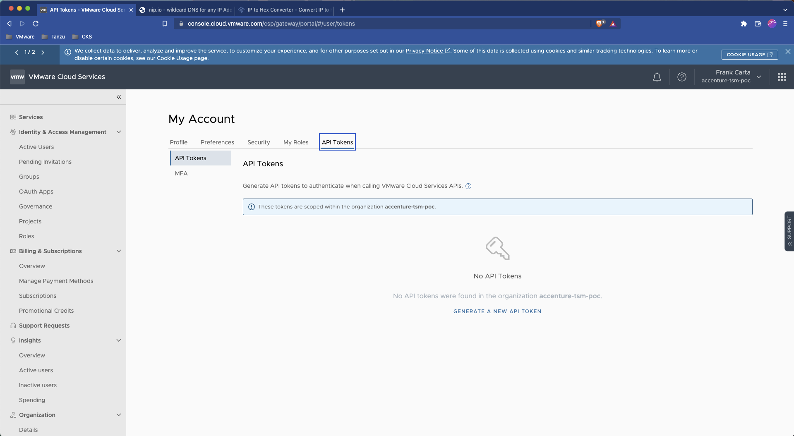

# SC01-TC03: Cloud Services Portal (CSP) Authorization via CSP API Token

This scenario captures how to authorize to the Cloud Services Portal (CSP) via API.

---

## Test Case Summary

This scenario test case generates a new CSP API Token and then uses that to generate a CSP API Authorization token for subsequent CSP API calls.

---

## Useful documentation

* Generating an API Token to Interact with VMware Cloud Service APIs [Generating an API Token to Interact with VMware Cloud Service APIs](https://docs.vmware.com/en/VMware-Cloud-services/services/Using-VMware-Cloud-Services/GUID-E2A3B1C1-E9AD-4B00-A6B6-88D31FCDDF7C.html)
* VMware Cloud Portal Auth/Token Flow for API calls [VMware Cloud Portal Auth/Token Flow for API calls](https://docs.vmware.com/en/vRealize-Operations/Cloud/com.vmware.vcom.api.doc/GUID-57E59E35-6C08-4424-A77F-468FACD35C41.html)

---

## Prerequisites

* Completion of registration and access to Cloud Service Portal.

---

## Test Procedure

1. If not already obtained, from the VMware Cloud Services Portal get or generate an API token. Copy the API token and save it to a secure note/place.(NOTE: Typically this would be created for an automation service account)

    

2. With this API token in place for `${CSP_API_TOKEN}` use the example below to obtain an authentication token from the VMware Cloud Service API. On successful authorization a response including an `access_token` will be returned which should be copied and retained for further API requests. For convienance and other test cases uses store the `access_token` into a environment variable called `CSP_AUTH_TOKEN`.

    ```execute
    curl -k -X POST "https://console.cloud.vmware.com/csp/gateway/am/api/auth/api-tokens/authorize" -H "Accept: application/json" -H "Content-Type: application/x-www-form-urlencoded" -d "refresh_token=${CSP_API_TOKEN}"
    ```

    Expected:

    ```json
    {
        "id_token": "REDACTED",
        "token_type": "bearer",
        "expires_in": 1799,
        "scope": "ALL_PERMISSIONS customer_number openid group_ids group_names",
        "access_token": "REDACTED",
        "refresh_token": "REDACTED"
    }
    ```

    > **_NOTE:_**  You can directly assign and obtain the `auth_token` with the following:

    ```execute
    export CSP_AUTH_TOKEN=$(curl -k -X POST "https://console.cloud.vmware.com/csp/gateway/am/api/auth/api-tokens/authorize" -H "accept: application/json" -H "Content-Type: application/x-www-form-urlencoded" -d "refresh_token=${CSP_API_TOKEN}" | jq -r '.access_token')
    ```

3. Test `CSP_AUTH_TOKEN` TODO[fcarta] - Find example to test

---

## Status Pass/Fail

* [  ] Pass
* [  ] Fail

Return to [Test Cases Inventory](../../README.md#test-cases-inventory)
