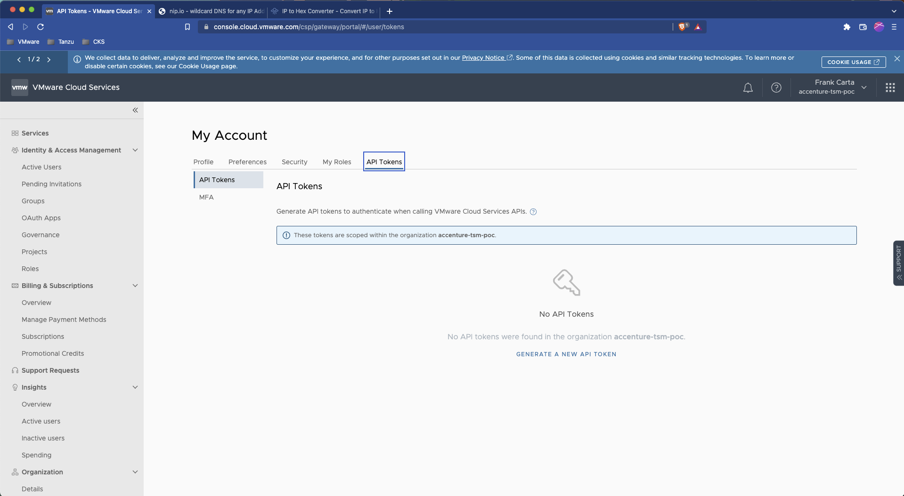

# SC02-TC03: Onboarding a Kubernetes Cluster to Tanzu Service Mesh (TSM) - Using TSM REST API

This scenario captures how a Kubernetes cluster can be onboarded to Tanzu Service Mesh (TSM).

---

## Test Case Summary

This scenario test case captures how to onboard a Kubernetes cluster to Tanzu Service Mesh (TSM) with REST API Calls. This is useful for those looking to automate their Kubernetes cluster onboarding.

---

## Useful documentation

* VMware Cloud Portal Auth/Token Flow for API calls [VMware Cloud Portal Auth/Token Flow for API calls](https://docs.vmware.com/en/vRealize-Operations/Cloud/com.vmware.vcom.api.doc/GUID-57E59E35-6C08-4424-A77F-468FACD35C41.html)
* Generating an API Token to Interact with VMware Cloud Service APIs [Generating an API Token to Interact with VMware Cloud Service APIs](https://docs.vmware.com/en/VMware-Cloud-services/services/Using-VMware-Cloud-Services/GUID-E2A3B1C1-E9AD-4B00-A6B6-88D31FCDDF7C.html)
* Tanzu Service Mesh API [Tanzu Service Mesh API](https://docs.vmware.com/en/VMware-Tanzu-Service-Mesh/services/api-programming-guide/GUID-FED8E849-B3C3-49ED-9FDB-1317CFFF3141.html)

---

## Prerequisites

* Completion of [SC01-TC01](../sc01-environment-setup/sc01-tc01-validate-tsm-console.md)

---

## Test Procedure

1. From the VMware Cloud Services Portal get or generate an API token. (NOTE: Typically this would be created for an automation service account)

    

2. With this API token in place for `${CSP-API-TOKEN}` use the example below to obtain an authentication token from the VMware Cloud Service API. On successful authorization a response including an `access_token` will be returned which should be copied and retained for further API requests.

    ```execute
    curl -k -X POST "https://console.cloud.vmware.com/csp/gateway/am/api/auth/api-tokens/authorize" -H "Accept: application/json" -H "Content-Type: application/x-www-form-urlencoded" -d "refresh_token=${CSP-API-TOKEN}"
    ```

    Expected:

    ```bash
    {
    "id_token": "REDACTED",
    "token_type": "bearer",
    "expires_in": 1799,
    "scope": "ALL_PERMISSIONS customer_number openid group_ids group_names",
    "access_token": "REDACTED",
    "refresh_token": "REDACTED"
    }
    ```

3. Begin onboarding your Kubernetes Cluster by retrieiving the TSM onboarding url. Execute the following REST API call by using your given TSM POC server value for the `${TSM-SERVER-NAME}` variable and the `access_token` obtained from the previous step as the value for the `${CSP-AUTH-TOKEN}` variable.

    ```execute
    curl -k -X GET "https://${TSM-SERVER-NAME}/tsm/v1alpha1/clusters/onboard-url" -H "csp-auth-token:${CSP-AUTH-TOKEN}"
    ```

    Expected:

    ```bash
    {
    "url":"https://${TSM-SERVER-NAME}/cluster-registration/k8s/operator-deployment.yaml"
    }
    ```

4. The TSM onboarding url obtained in the previous step contains the needed Kubernetes manifests/objects and custom resource definitions (CRDs) for installing Tanzu Service Mesh components into your cluster. Apply this file reference to your Kubernetes cluster with the following commands. For `${CLUSTER-CONTEXT-NAME}` use the context name for your targeted Kubernetes cluster and the TSM onboarding url from the previous step for the `${TSM-ONBOARDING-URL}` variable.

    ```execute
    kubectl --context ${CLUSTER-CONTEXT-NAME} apply -f ${TSM-ONBOARDING-URL}
    ```

    Expected:

    ```bash
    namespace/vmware-system-tsm created
    customresourcedefinition.apiextensions.k8s.io/aspclusters.allspark.vmware.com created
    customresourcedefinition.apiextensions.k8s.io/clusters.client.cluster.tsm.tanzu.vmware.com created
    customresourcedefinition.apiextensions.k8s.io/tsmclusters.tsm.vmware.com created
    customresourcedefinition.apiextensions.k8s.io/clusterhealths.client.cluster.tsm.tanzu.vmware.com created
    configmap/tsm-agent-operator created
    serviceaccount/tsm-agent-operator-deployer created
    clusterrole.rbac.authorization.k8s.io/tsm-agent-operator-cluster-role created
    role.rbac.authorization.k8s.io/vmware-system-tsm-namespace-admin-role created
    clusterrolebinding.rbac.authorization.k8s.io/tsm-agent-operator-crb created
    rolebinding.rbac.authorization.k8s.io/tsm-agent-operator-rb created
    deployment.apps/tsm-agent-operator created
    serviceaccount/operator-ecr-read-only--service-account created
    secret/operator-ecr-read-only--aws-credentials created
    role.rbac.authorization.k8s.io/operator-ecr-read-only--role created
    rolebinding.rbac.authorization.k8s.io/operator-ecr-read-only--role-binding created
    Warning: batch/v1beta1 CronJob is deprecated in v1.21+, unavailable in v1.25+; use batch/v1 CronJob
    cronjob.batch/operator-ecr-read-only--renew-token created
    job.batch/operator-ecr-read-only--renew-token created
    job.batch/update-scc-job created
    ```

5. Submit the a request to onboard your Kubernetes cluster with the following command. For the `${TSM-SERVER-NAME}` value add your given TSM POC server. For `${CLUSTER-NAME}` you can use whatever name you want here but it would make sense to make it the same as the cluster context name you use for the kube configuration (NOTE: There are restrictions on the allowed characters for a cluster name, use all lower case letters and dashes). Use the `auth_token` value from previous authentication step for `${CSP-AUTH-TOKEN}`.

    ```bash
    curl -k -X PUT "https://${TSM-SERVER-NAME}/tsm/v1alpha1/clusters/${CLUSTER-NAME}?createOnly=true" -H "csp-auth-token:${CSP-AUTH-TOKEN}" -H "Content-Type: application/json" -d '
    {
        "displayName": "${CLUSTER-NAME}",
        "description": "",
        "autoInstallServiceMesh": false,
        "enableNamespaceExclusions":true,
        "namespaceExclusions": [{
            "match": "kapp-controller",
            "type": "EXACT"
        },{
            "match": "kube-node-lease",
            "type": "EXACT"
        },{
            "match": "kube-public",
            "type": "EXACT"
        },{
            "match": "kube-system",
            "type": "EXACT"
        },{
        ... ADD/REMOVE NAMESPACES YOU WANT TO EXCLUDE
        }]
    }'
    ```

    Expected:

    ```bash
    {
    "displayName": "${CLUSTER-NAME}",
    "description": "",
    "tags": [],
    "labels": [],
    "autoInstallServiceMesh": false,
    "enableNamespaceExclusions": true,
    "namespaceExclusions":
        [
        { "match": "kapp-controller", "type": "EXACT" },
        { "match": "kube-node-lease", "type": "EXACT" },
        { "match": "kube-public", "type": "EXACT" },
        { "match": "kube-system", "type": "EXACT" },
        # DEPENDS ON NAMESPACES INCLUDED IN STEP ABOVE
        ],
    "proxyConfig": { "password": "**redacted**" },
    "id": "${CLUSTER-NAME}",
    "token": "REDACTED",  # <--------------------- ONBOARDING TOKEN HERE
    "registered": false,
    "systemNamespaceExclusions":
        [
        { "match": "allspark", "type": "EXACT" },
        { "match": "gatekeeper-system", "type": "EXACT" },
        { "match": "istio-system", "type": "EXACT" },
        { "match": "metallb-system", "type": "EXACT" },
        { "match": "nsx-system", "type": "EXACT" },
        { "match": "pks-system", "type": "EXACT" },
        { "match": "tanzu-observability-saas", "type": "EXACT" },
        { "match": "velero", "type": "EXACT" },
        { "match": "kube-", "type": "START_WITH" },
        { "match": "openshift", "type": "START_WITH" },
        { "match": "vmware-system-", "type": "START_WITH" },
        { "match": "avi-system", "type": "EXACT" },
        ],
    "proxy": "",
    "autoInstallServiceMeshConfig": { "restrictDefaultExternalAccess": false },
    "registryAccount": "",
    "caLabels": [],
    }
    ```

6. Generate a private secret to allow TSM to establish secure connection to the global TSM control plane. Run the following command with the `token` value from the previous step for the `${TSM-ONBOARDING-TOKEN}` variable.

    ```execute
    kubectl -n vmware-system-tsm create secret generic cluster-token --from-literal=token=${TSM-ONBOARDING-TOKEN}
    ```

    Expected:

    ```bash
    secret/cluster-token created
    ```

7. Validate that TSM was able to make a secure connection to the global TSM control plane. For the `${TSM-SERVER-NAME}` value add your given TSM POC server. For `${CLUSTER-NAME}` use the name you provided in the previous steps. Use the `auth_token` value from previous authentication step for `${CSP-AUTH-TOKEN}`.

    ```execute
    curl -k -X GET "https://${TSM-SERVER-NAME}/tsm/v1alpha1/clusters/${CLUSTER-NAME}" -H "csp-auth-token:${CSP-AUTH-TOKEN}"
    ```

    Expected:

    ```bash
    {
    "displayName": "${CLUSTER-NAME}",
    "description": "",
    "tags": [],
    "labels": [],
    "autoInstallServiceMesh": false,
    "enableNamespaceExclusions": true,
    "namespaceExclusions": [
        ...
    ],
    "proxyConfig": {
        "password": "**redacted**"
    },
    "id": "${CLUSTER-NAME}",
    "name": "${CLUSTER-NAME}",
    "type": "Kubernetes",
    "version": "v1.21.8+vmware.1",
    "status": {
        "state": "Connected",  # <---------------------  MAKE SURE THIS SAYS CONNECTED
        "metadata": {
        "substate": "",
        "progress": 0
        },
        "code": 0,
        "message": "Cluster registration succeeded",
        "updateTimestamp": "2022-06-23T19:47:14Z"
    },
    ...
    }
    ```

8. When the `status.state` field shows `Connected` from the step above then you can install TSM to your Kubernetes cluster. For the `${TSM-SERVER-NAME}` value add your given TSM POC server. For `${CLUSTER-NAME}` use the name you provided in the previous steps. Use the `auth_token` value from previous authentication step for `${CSP-AUTH-TOKEN}`. To install the latest TSM version use `default` as a value for `${TSM-VERSION}`.

    ```execute
    curl -k -X PUT "https://${TSM-SERVER-NAME}/tsm/v1alpha1/clusters/${CLUSTER-NAME}/apps/tsm" -H "csp-auth-token:${CSP-AUTH-TOKEN}" -H "Content-Type: application/json" -d '{"version": "${TSM-VERSION}"}'
    ```

    Expected:

    ```bash
    {"id":"<REDACTED>"}
    ```

9. The TSM installation can take a couple minutes. To check/validate the status of the installation run the following. For the `${TSM-SERVER-NAME}` value add your given TSM POC server. For `${CLUSTER-NAME}` use the name you provided in the previous steps. Use the `auth_token` value from previous authentication step for `${CSP-AUTH-TOKEN}`.

    ```execute
    curl -k -X GET "https://${TSM-SERVER-NAME}/tsm/v1alpha1/clusters/${CLUSTER-NAME}" -H "csp-auth-token:${CSP-AUTH-TOKEN}"
    ```

    Expected:

    ```bash
    ...
    "status": {
        "state": "Installing", # <---------------------  TSM is INSTALLING
        "metadata": {
        "substate": "",
        "progress": 60
        },
        "code": 0,
        "message": "Installing mesh dependencies...", # <--------------------- PROGRESS MESSAGING
        "updateTimestamp": "2022-06-23T19:57:03Z"
    },
    ...
    ```

    State should go from `Installing` to `Ready` when TSM installation is complete.

    ```bash
    ...
    "status": {
        "state": "Ready", # <---------------------  MAKE SURE THIS GOES FROM `Installing` TO `Ready`
        "metadata": {
        "substate": "",
        "progress": 0
        },
        "code": 0,
        "message": "",
        "updateTimestamp": "2022-06-23T19:57:53Z"
    },
    ...
    ```

10. Validate an external Loadbalancer was created

    ```execute
    kubectl get svc -A | grep LoadBalancer
    ```

    Expected:

    ```sh
    istio-system              istio-ingressgateway            LoadBalancer   100.68.30.11     <REDACTED>.us-west-2.elb.amazonaws.com   15021:31714/TCP,80:31268/TCP,443:32006/TCP   11d
    ```

---

## Status Pass/Fail

* [  ] Pass
* [  ] Fail

Return to [Test Cases Inventory](../../README.md#test-cases-inventory)
