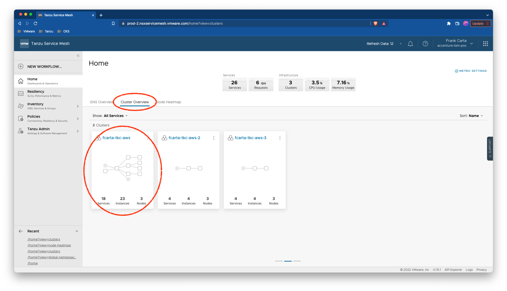

# SC03-TC01: Application Deployment to Kubernetes Cluster with Tanzu Service Mesh (TSM) - Deploying ACME Fitness Sample Application

This scenario captures how to deploy an application to a Kubernetes Cluster with Tanzu Service Mesh

---

## Test Case Summary

This scenario test case captures how to deploy the ACME Fitness sample application to a Kubernetes Cluster with Tanzu Service Mesh (TSM)

---

## Prerequisites

* Completion of TSM Console access [SC01-TC01](../sc01-environment-setup/sc01-tc01-validate-tsm-console.md)
* Completion of TSM Onboarding Kubernetes Cluster [SC02-TC01](../sc02-cluster-onboarding/sc02-tc01-onboard-tsm-ui.md) or [SC02-TC02](../sc02-cluster-onboarding/sc02-tc02-onboard-tmc.md) or [SC02-TC03](../sc02-cluster-onboarding/sc02-tc03-onboard-tsm-api.md)
* Valid `kubeconfig` and token for targeted Kubernetes Cluster

---

## Test Procedure

1. Confirm you are connected the right Kubernetes cluster `${KUBERNETES_CLUSTER1_CONTEXT}`, if working from the supplied Management container you can run the following:

    ```execute
    kubectx
    ```

    Expected:<pre>
    tkc-aws-2-admin@tkc-aws-2
    tkc-aws-3-admin@tkc-aws-3
    <b><font color="yellow">${KUBERNETES_CLUSTER1_CONTEXT}</font></b></pre>

    > **_NOTE:_**  If needed to change to the `${KUBERNETES_CLUSTER1_CONTEXT}` context running the following.

    ```execute
    kubectx ${KUBERNETES_CLUSTER1_CONTEXT}
    ```

    Otherwise, if not using the supplied Management Container, run the following:

    ```sh
    kubectl config current-context
    ```

    > **_NOTE:_**  If needed to change to the `${KUBERNETES_CLUSTER1_CONTEXT}` context running the following.

    ```sh
    kubectl config set-context ${KUBERNETES_CLUSTER1_CONTEXT}
    ```

2. Confirm your preferred namespace is set to `${KUBERNETES_CLUSTER1_NAMESPACE}` (Using `default` as the namespace works fine.), if working from the supplied Management container you can run the following:

    ```execute
    kubens
    ```

    Expected:<pre>
    ...
    <b><font color="yellow">${KUBERNETES_CLUSTER1_NAMESPACE}</font><b>
    istio-system
    kapp-controller
    kube-node-lease
    kube-public
    ...
    </pre>

    > **_NOTE:_**  If needed to change to the `${KUBERNETES_CLUSTER1_NAMESPACE}` namespace running the following.

    ```execute
    kubens ${KUBERNETES_CLUSTER1_NAMESPACE}
    ```

    Otherwise, if not using the supplied Management Container, run the following:

    ```sh
    kubectl config view --minify --output 'jsonpath={..namespace}'; echo
    ```

    > **_NOTE:_**  If needed to change to the `${KUBERNETES_CLUSTER1_NAMESPACE}` namespace running the following.

    ```sh
    kubectl config set-context --current --namespace=${KUBERNETES_CLUSTER1_NAMESPACE}
    ```

3. Deploy the supplied Kubernetes manifests for the ACME Fitness Application.

    ```execute
    kubectl apply -f scenarios/files/acme-fitness-app/app/acme-fitness.yaml
    kubectl apply -f scenarios/files/acme-fitness-app/app/acme-gateway.yaml
    kubectl apply -f scenarios/files/acme-fitness-app/app/acme-secrets.yaml
    kubectl apply -f scenarios/files/acme-fitness-app/app/acme-fitness-catalog-west.yaml
    ```

    Expected:<pre>
    deployment.apps/cart-redis created
    service/cart created
    deployment.apps/cart created
    service/shopping created
    deployment.apps/shopping created
    service/order-mongo created
    deployment.apps/order-mongo created
    service/order created
    deployment.apps/order created
    service/payment created
    deployment.apps/payment created
    configmap/users-initdb-config created
    service/users-mongo created
    deployment.apps/users-mongo created
    service/users created
    deployment.apps/users created
    ...
    gateway.networking.istio.io/acme-gateway created
    virtualservice.networking.istio.io/acme created
    ...
    secret/redis-pass created
    secret/catalog-mongo-pass created
    secret/order-mongo-pass created
    secret/users-mongo-pass created
    ...
    configmap/catalog-initdb-config created
    service/catalog-mongo created
    deployment.apps/catalog-mongo created
    service/catalog created
    deployment.apps/catalog created
    </pre>

4. Validate all pods for the ACME Fitness application are running

    ```execute
    kubectl get pods
    ```

    Expected:<pre>
    NAME                            READY   STATUS    RESTARTS   AGE
    cart-844fcb9497-qkc4x           2/2     Running   0          13s
    cart-redis-df554fbb7-vs5m6      2/2     Running   0          13s
    order-55b6987599-l42xj          2/2     Running   0          13s
    order-mongo-7ccdbd8869-mj8qc    2/2     Running   0          13s
    payment-6977b8df86-rmfph        2/2     Running   0          13s
    shopping-6ff46695f5-rr9m2       2/2     Running   0          13s
    users-5cf6b58489-p4l5z          2/2     Running   0          13s
    users-mongo-74c459f9f7-xpqbf    2/2     Running   0          13s
    catalog-5cd86dc8d6-llr99        2/2     Running   0          13s
    catalog-mongo-8df44d45-lc242    2/2     Running   0          13s
    </pre>

5. View ACME Fitness Services Running

    ```execute
    kubectl get services
    ```

    Expected:<pre>
    NAME           TYPE        CLUSTER-IP       EXTERNAL-IP   PORT(S)     AGE
    cart           ClusterIP   100.67.53.201    `<none>`        5000/TCP    52s
    cart-redis     ClusterIP   100.69.70.179    `<none>`        6379/TCP    52s
    kubernetes     ClusterIP   100.64.0.1       `<none>`        443/TCP     52d
    loadgen        ClusterIP   100.71.244.67    `<none>`        80/TCP      52s
    order          ClusterIP   100.71.170.200   `<none>`        6000/TCP    52s
    order-mongo    ClusterIP   100.70.195.57    `<none>`        27017/TCP   52s
    payment        ClusterIP   100.64.139.183   `<none>`        9000/TCP    52s
    shopping       ClusterIP   100.68.234.11    `<none>`        3000/TCP    52s
    users          ClusterIP   100.65.54.70     `<none>`        8081/TCP    52s
    users-mongo    ClusterIP   100.69.189.191   `<none>`        27017/TCP   52s
    catalog        ClusterIP   100.68.133.208   `<none>`        8082/TCP    52s
    catalog-mongo  ClusterIP   100.66.143.64    `<none>`        27017/TCP   52s
    </pre>

6. Get the ACME Fitness Applicaiton endpoint from the `EXTERNAL-IP` of the TSM LoadBalancer object and paste into browser.

    ```execute
    kubectl get svc -A | grep LoadBalancer
    ```

    Expected:<pre>
    istio-system              istio-ingressgateway            LoadBalancer   100.68.30.11     <b><font color="yellow">`<REDACTED>`.us-west-2.elb.amazonaws.com</font></b>   15021:31714/TCP,80:31268/TCP,443:32006/TCP   11d
    </pre>

    > **_NOTE:_**  It is recommended that you have a POC test domain name that you can configure DNS for the ACME Ftiness Application and map to this `EXTERNAL-IP`.

    ---
    ACME Fitness Application (as seen in the browser)
    

7. In order for the Service Topology to build out in the TSM console lets generate some traffic for the ACME Fitness Application.

    ```execute
    kubectl apply -f scenarios/files/acme-fitness-app/loadgen/acme-loadgen.yaml
    ```

    Expected:<pre>
    service/loadgen created
    deployment.apps/loadgenerator created
    </pre>

8. Validate the ACME Fitness Application load generator is running.

    ```execute
    kubectl get pods
    ```

    Expected:<pre>
    NAME                            READY   STATUS    RESTARTS   AGE
    cart-844fcb9497-qkc4x           2/2     Running   0          11m
    cart-redis-df554fbb7-vs5m6      2/2     Running   0          11m
    <b><font color="yellow">loadgenerator-fbfdf7d99-jkb9g   2/2     Running   0          10s</font><b>
    order-55b6987599-l42xj          2/2     Running   0          11m
    order-mongo-7ccdbd8869-mj8qc    2/2     Running   0          11m
    payment-6977b8df86-rmfph        2/2     Running   0          11m
    shopping-6ff46695f5-rr9m2       2/2     Running   0          11m
    users-5cf6b58489-p4l5z          2/2     Running   0          11m
    users-mongo-74c459f9f7-xpqbf    2/2     Running   0          11m
    catalog-5cd86dc8d6-llr99        2/2     Running   0          11m
    catalog-mongo-8df44d45-lc242    2/2     Running   0          11m
    </pre>

    > **_NOTE:_**  Optional: You can also verify the load generation service is running.

    ```execute
    kubectl get svc
    ```

9. After some time (typically a few minutes) traffic metrics for the AMCE Fitness Application will begin to flow into the TSM central control plane. To view this application data access your TSM console and navigate to the `Cluster Overview` tab on the `Home` page and click on the Kubernetes Cluster `${KUBERNETES_CLUSTER1_CONTEXT}` where you deployed the ACME Fitness Application. On this Cluster Home page under the `Service Topology` tab you should see the ACME Fitness Appliction services plus the load generator service added in the previous step.

    Expected:

    ---
    TSM Home - Cluster Overview
    

    ---
    TSM Cluster - Service Topology for ACME Fitness Application
    

---

## Status Pass/Fail

* [  ] Pass
* [  ] Fail

Return to [Test Cases Inventory](../../README.md#test-cases-inventory)
