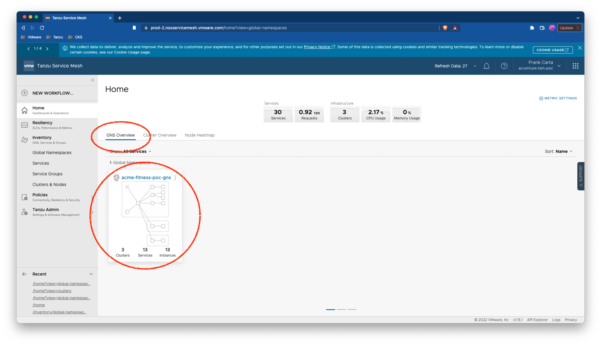
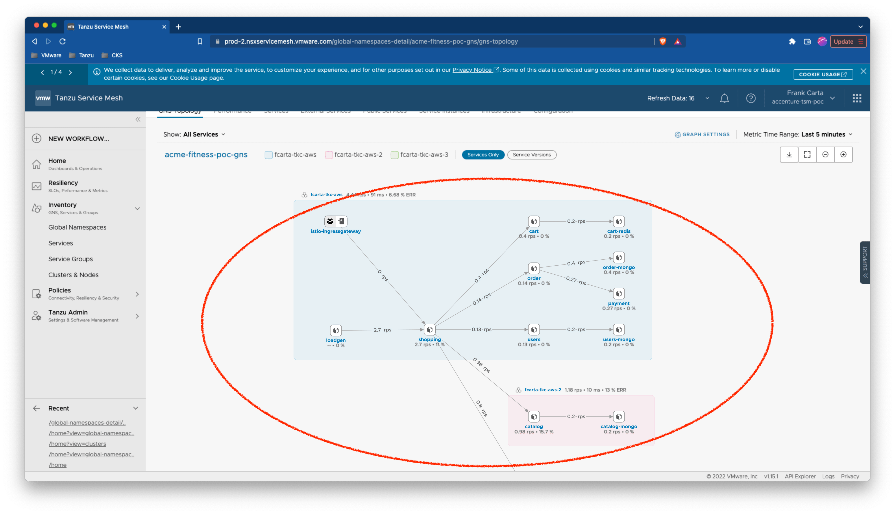
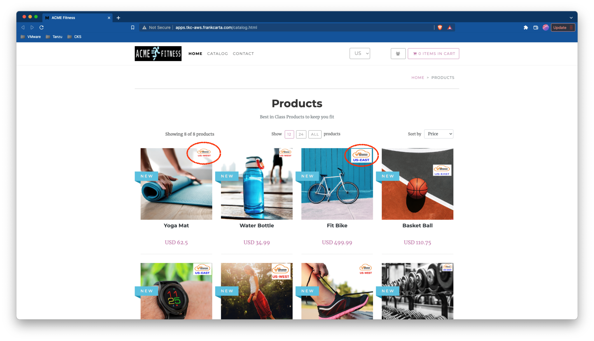

# SC03-TC01: Application Deployment to Kubernetes Cluster with Tanzu Service Mesh (TSM) - Deploying a Multi-Cluster ACME Fitness Application with a Global Namespace (GNS)

This scenario captures how to deploy an application to a Kubernetes Cluster with Tanzu Service Mesh

---

## Test Case Summary

This scenario test case captures how to create a Tanzu Service Mesh Global Namespace (GNS) with the TSM REST API and then deploy a multi-cluster version of the ACME Fitness sample application across the GNS.

---

## Useful documentation

* VMware Cloud Portal Auth/Token Flow for API calls [VMware Cloud Portal Auth/Token Flow for API calls](https://docs.vmware.com/en/vRealize-Operations/Cloud/com.vmware.vcom.api.doc/GUID-57E59E35-6C08-4424-A77F-468FACD35C41.html)
* Generating an API Token to Interact with VMware Cloud Service APIs [Generating an API Token to Interact with VMware Cloud Service APIs](https://docs.vmware.com/en/VMware-Cloud-services/services/Using-VMware-Cloud-Services/GUID-E2A3B1C1-E9AD-4B00-A6B6-88D31FCDDF7C.html)
* Tanzu Service Mesh API [Tanzu Service Mesh API](https://docs.vmware.com/en/VMware-Tanzu-Service-Mesh/services/api-programming-guide/GUID-FED8E849-B3C3-49ED-9FDB-1317CFFF3141.html)

---

## Prerequisites

* Completion of TSM Console access [SC01-TC01](../sc01-environment-setup/sc01-tc01-validate-tsm-console.md)
* For Two(2) Kubernetes Clusters `${KUBERNETES_CLUSTER1}` and `${KUBERNETES_CLUSTER2}` completion of TSM Onboarding  [SC02-TC01](../sc02-cluster-onboarding/sc02-tc01-onboard-tsm-ui.md) or [SC02-TC02](../sc02-cluster-onboarding/sc02-tc02-onboard-tmc.md) or [SC02-TC03](../sc02-cluster-onboarding/sc02-tc03-onboard-tsm-api.md)
* Completion of ACME Fitness Application Deployment [SC03-TC01](../sc03-application-deployment/sc03-tc01-acme-fitness-application.md)
* Valid `kubeconfig` for both targeted Kubernetes Clusters `${KUBERNETES_CLUSTER1}` and `${KUBERNETES_CLUSTER2}`

---

## Test Procedure

This test procedure assumes that the full ACME Fitness Application along with the load generator was deployed to the Kubernetes Cluster `${KUBERNETES_CLUSTER1}`.

1. To create a multi-cluster application deploy another catalog service to the second Kubernetes Cluster `${KUBERNETES_CLUSTER2}`. Confirm you are connected the right Kubernetes cluster `${KUBERNETES_CLUSTER2_CONTEXT}`, if working from the supplied Management container you can run the following:

    ```execute
    kubectx
    ```

    Expected:<pre>
    tkc-aws-1-admin@tkc-aws-1
    tkc-aws-3-admin@tkc-aws-3
    <b><font color="yellow">${KUBERNETES_CLUSTER2_CONTEXT}</font></b></pre>

    > **_NOTE:_**  If needed to change to the `${KUBERNETES_CLUSTER2_CONTEXT}` context running the following.

    ```execute
    kubectx ${KUBERNETES_CLUSTER2_CONTEXT}
    ```

    Otherwise, if not using the supplied Management Container, run the following:

    ```sh
    kubectl config current-context
    ```

    > **_NOTE:_**  If needed to change to the `${KUBERNETES_CLUSTER2_CONTEXT}` context running the following.

    ```sh
    kubectl config set-context ${KUBERNETES_CLUSTER2_CONTEXT}
    ```

2. Confirm your preferred namespace is set to `${KUBERNETES_CLUSTER2_NAMESPACE}` (Using `default` as the namespace works fine.), if working from the supplied Management container you can run the following:

    ```execute
    kubens
    ```

    Expected:<pre>
    ...
    <b><font color="yellow">${KUBERNETES_CLUSTER2_NAMESPACE}</font></b>
    istio-system
    kapp-controller
    kube-node-lease
    kube-public
    ...
    </pre>

    > **_NOTE:_**  If needed to change to the `${KUBERNETES_CLUSTER2_NAMESPACE}` namespace running the following.

    ```execute
    kubens ${KUBERNETES_CLUSTER2_NAMESPACE}
    ```

    Otherwise, if not using the supplied Management Container, run the following:

    ```sh
    kubectl config view --minify --output 'jsonpath={..namespace}'; echo
    ```

    > **_NOTE:_**  If needed to change to the `${KUBERNETES_CLUSTER2_NAMESPACE}` namespace running the following.

    ```sh
    kubectl config set-context --current --namespace=${KUBERNETES_CLUSTER2_NAMESPACE}
    ```

3. Deploy the catalog(east) Kubernetes manifests for the ACME Fitness Application.

    ```execute
    kubectl apply -f scenarios/files/acme-fitness-app/app/acme-secrets.yaml
    kubectl apply -f scenarios/files/acme-fitness-app/app/acme-fitness-catalog-east.yaml
    ```

    Expected:<pre>
    secret/redis-pass created
    secret/catalog-mongo-pass created
    secret/order-mongo-pass created
    secret/users-mongo-pass created
    ...
    configmap/catalog-initdb-config created
    service/catalog-mongo created
    deployment.apps/catalog-mongo created
    service/catalog created
    deployment.apps/catalog created
    </pre>

4. If not already obtained, from the VMware Cloud Services Portal get or generate an API token. Copy the API token and save it to a secure note/place.(NOTE: Typically this would be created for an automation service account)

    

5. With this API token in place for `${CSP_API_TOKEN}` use the example below to obtain an authentication token from the VMware Cloud Service API. On successful authorization a response including an `access_token` will be returned which should be copied and retained for further API requests.

    ```execute
    curl -k -X POST "https://console.cloud.vmware.com/csp/gateway/am/api/auth/api-tokens/authorize" -H "Accept: application/json" -H "Content-Type: application/x-www-form-urlencoded" -d "refresh_token=${CSP_API_TOKEN}"
    ```

    Expected:

    ```json
    {
        "id_token": "REDACTED",
        "token_type": "bearer",
        "expires_in": 1799,
        "scope": "ALL_PERMISSIONS customer_number openid group_ids group_names",
        "access_token": "REDACTED",
        "refresh_token": "REDACTED"
    }
    ```

    > **_NOTE:_**  You can directly assign and obtain the `auth_token` with the following:

    ```execute
    export CSP_AUTH_TOKEN=$(curl -k -X POST "https://console.cloud.vmware.com/csp/gateway/am/api/auth/api-tokens/authorize" -H "accept: application/json" -H "Content-Type: application/x-www-form-urlencoded" -d "refresh_token=${CSP_API_TOKEN}" | jq -r '.access_token')
    ```

6. Create a Global Namespace (GNS) . Execute the following REST API call by using your given TSM POC server value for the `${TSM_SERVER_NAME}` variable and the `access_token` obtained from the previous step as the value for the `${CSP_AUTH_TOKEN}` variable.

    ```bash
    curl -k -X POST "https://${TSM_SERVER_NAME}/tsm/v1alpha1/global-namespaces" -H "csp-auth-token:${CSP_AUTH_TOKEN}" -H "Content-Type: application/json" -d '
    {
        "name": "'"${TSM_GLOBALNAMESPACE_NAME}"'",
        "display_name": "'"${TSM_GLOBALNAMESPACE_NAME}"'",
        "domain_name": "'"${TSM_GLOBALNAMESPACE_DOMAIN}"'",
        "mtls_enforced": true,
        "version": "1.0",
        "match_conditions":[{
            "namespace":{
                "type": "EXACT",
                "match": "'"${KUBERNETES_CLUSTER1_NAMESPACE}"'"
            },
            "cluster":{
                "type": "EXACT",
                "match": "'"${KUBERNETES_CLUSTER1}"'"
            }
        },{
            "namespace":{
                "type": "EXACT",
                "match": "'"${KUBERNETES_CLUSTER2_NAMESPACE}"'"
            },
            "cluster":{
                "type": "EXACT",
                "match": "'"${KUBERNETES_CLUSTER2}"'"
            }
        }]
    }'
    ```

    Expected:

    ```json
    {
        "name": "${TSM_GLOBALNAMESPACE_NAME}",
        "display_name": "${TSM_GLOBALNAMESPACE_NAME}",
        "domain_name": "${TSM_GLOBALNAMESPACE_DOMAIN}",
        "use_shared_gateway": false,
        "mtls_enforced": true,
        "ca_type": "",
        "ca": "",
        "description": "",
        "color": "",
        "version": "1.0",
        "match_conditions": [{
            "namespace": {
                "match": "${KUBERNETES_CLUSTER1_NAMESPACE}",
                "type": "EXACT"
            },
            "cluster": {
                "match": "${KUBERNETES_CLUSTER1}",
                "type": "EXACT"
            }
        },{
            "namespace": {
                "match": "${KUBERNETES_CLUSTER2_NAMESPACE}",
                "type": "EXACT"
            },
            "cluster": {
                "match": "${KUBERNETES_CLUSTER2}",
                "type": "EXACT"
            }
        }],
        "api_discovery_enabled": true
    }
    ```

7. Validate the GNS was created via the TSM console. Navigate to the `GNS Overview` tab on the `Home` page and click on the GNS `${TSM_GLOBALNAMESPACE_NAME}`. On the GNS Overview page under the `GNS Topology` tab you should see both the Kubernetes Clusters and the ACME Fitness Appliction services. NOTE connection between the Kubernets Clusters will not show until we configure the `shopping` deployment in the following steps.

    Expected:

    ---
    TSM Home - GNS Overview
    

    ---
    TSM GNS Overview - GNS Topology for ACME Fitness Application
    

8. Now that the GNS has been successfully created we need to configure the ACME Fitness `shopping` deployment to now point to the `catalog` service connected to the GNS domain and not the default local `catalog` service. To do this we must switch back our `kubectl context` back to the first cluster Kubernetes Cluster `${KUBERNETES_CLUSTER1}`. Confirm you are connected the right Kubernetes cluster `${KUBERNETES_CLUSTER1_CONTEXT}`, if working from the supplied Management container you can run the following:

    ```execute
    kubectx
    ```

    Expected:<pre>
    tkc-aws-1-admin@tkc-aws-2
    tkc-aws-3-admin@tkc-aws-3
    <b><font color="yellow">${KUBERNETES_CLUSTER1_CONTEXT}</font></b></pre>

    > **_NOTE:_**  If needed to change to the `${KUBERNETES_CLUSTER1_CONTEXT}` context running the following.

    ```execute
    kubectx ${KUBERNETES_CLUSTER1_CONTEXT}
    ```

    Otherwise, if not using the supplied Management Container, run the following:

    ```sh
    kubectl config current-context
    ```

    > **_NOTE:_**  If needed to change to the `${KUBERNETES_CLUSTER1_CONTEXT}` context running the following.

    ```sh
    kubectl config set-context ${KUBERNETES_CLUSTER1_CONTEXT}
    ```

9. Confirm your preferred namespace is set to `${KUBERNETES_CLUSTER1_NAMESPACE}` (Using `default` as the namespace works fine.), if working from the supplied Management container you can run the following:

    ```execute
    kubens
    ```

    Expected:<pre>
    ...
    <b><font color="yellow">${KUBERNETES_CLUSTER1_NAMESPACE}</font></b>
    istio-system
    kapp-controller
    kube-node-lease
    kube-public
    ...
    </pre>

    > **_NOTE:_**  If needed to change to the `${KUBERNETES_CLUSTER1_NAMESPACE}` namespace running the following.

    ```execute
    kubens ${KUBERNETES_CLUSTER1_NAMESPACE}
    ```

    Otherwise, if not using the supplied Management Container, run the following:

    ```sh
    kubectl config view --minify --output 'jsonpath={..namespace}'; echo
    ```

    > **_NOTE:_**  If needed to change to the `${KUBERNETES_CLUSTER1_NAMESPACE}` namespace running the following.

    ```sh
    kubectl config set-context --current --namespace=${KUBERNETES_CLUSTER1_NAMESPACE}
    ```

10. Edit the shopping deployment to use the GNS `catalog` service instead of the local service.

    ```execute
    kubectl edit deploy/shopping
    ```

    Change the `catalog` service configuration from the local reference to the GNS reference.

    ```yaml
    ...
        spec:
      containers:
      - env:
        - name: FRONTEND_PORT
          value: "3000"
        - name: USERS_HOST
          value: users
        - name: CATALOG_HOST
          value: catalog   # <---------------------  change this service to include the gns domain
        - name: ORDER_HOST
          value: order
    ...
    ```

    Changing the `catalog` service to the GNS reference should look like the example below:

    ```yaml
    ...
        spec:
      containers:
      - env:
        - name: FRONTEND_PORT
          value: "3000"
        - name: USERS_HOST
          value: users
        - name: CATALOG_HOST
          value: catalog.${TSM_GLOBALNAMESPACE_DOMAIN}
        - name: ORDER_HOST
          value: order
    ...
    ```

    Expected:<pre>
    deployment.apps/shopping edited
    </pre>

11. Validate that traffic is flowing between the ACME Fitness Application across the two(2) Kubernetes Clusters ( `${KUBERNETES_CLUSTER1}` , `${KUBERNETES_CLUSTER2}` ) over the GNS. Navigate to the `GNS Overview` tab on the `Home` page and click on the GNS `${TSM_GLOBALNAMESPACE_NAME}`. On the GNS Overview page under the `GNS Topology` tab you should see both the Kubernetes Clusters and the ACME Fitness Appliction services. Also validate via browser that the ACME Fitness Application is showing both the East and West catalog images (You may need clear/disable caching to see images rotate).

    ---
    TSM GNS Overview - GNS Topology for ACME Fitness Application
    

    ---
    ACME Fitness Application over GNS (East/West Images)
    

---

## Status Pass/Fail

* [  ] Pass
* [  ] Fail

Return to [Test Cases Inventory](../../README.md#test-cases-inventory)
