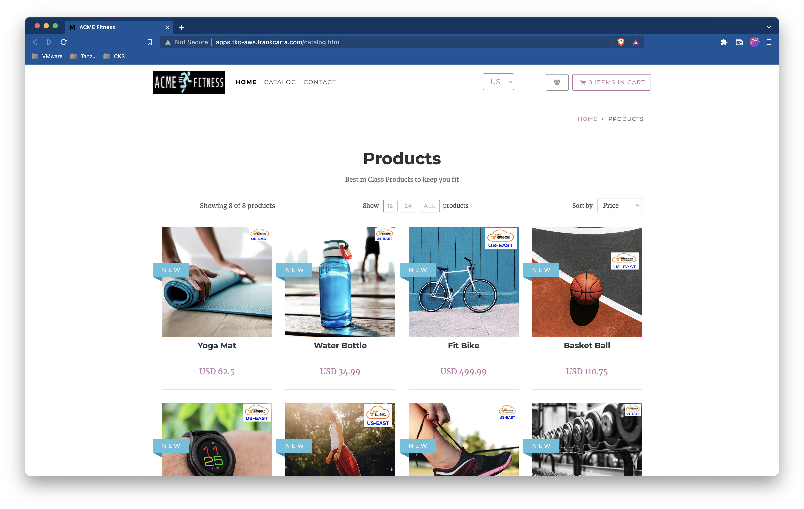

# SC05-TC01: Application Resiliency with Tanzu Service Mesh (TSM) - Creating Traffic Management Policies

This scenario captures how to create different traffic management policies for application resiliency.

---

## Test Case Summary

This scenario test case creates three(3) different traffic management policies: weighted, query parameter based, and http header based for the ACME Fitness Application. Each traffic management policy will redirect catalog traffic to either the east/west based service and images.

---

## Useful documentation

* VMware Cloud Portal Auth/Token Flow for API calls [VMware Cloud Portal Auth/Token Flow for API calls](https://docs.vmware.com/en/vRealize-Operations/Cloud/com.vmware.vcom.api.doc/GUID-57E59E35-6C08-4424-A77F-468FACD35C41.html)
* Generating an API Token to Interact with VMware Cloud Service APIs [Generating an API Token to Interact with VMware Cloud Service APIs](https://docs.vmware.com/en/VMware-Cloud-services/services/Using-VMware-Cloud-Services/GUID-E2A3B1C1-E9AD-4B00-A6B6-88D31FCDDF7C.html)
* Tanzu Service Mesh API [Tanzu Service Mesh API](https://docs.vmware.com/en/VMware-Tanzu-Service-Mesh/services/api-programming-guide/GUID-FED8E849-B3C3-49ED-9FDB-1317CFFF3141.html)

---

## Prerequisites

* Completion of TSM Console access [SC01-TC01](../sc01-environment-setup/sc01-tc01-validate-tsm-console.md)
* For Two(2) Kubernetes Clusters `${KUBERNETES_CLUSTER1}` and `${KUBERNETES_CLUSTER2}` completion of TSM Onboarding  [SC02-TC01](../sc02-cluster-onboarding/sc02-tc01-onboard-tsm-ui.md) or [SC02-TC02](../sc02-cluster-onboarding/sc02-tc02-onboard-tmc.md) or [SC02-TC03](../sc02-cluster-onboarding/sc02-tc03-onboard-tsm-api.md)
* Completion of ACME Fitness Application Deployment [SC03-TC01](../sc03-application-deployment/sc03-tc01-acme-fitness-application.md)
* Completion of Global Namespace creation for ACME Fitness Application [SC03-TC03](../sc03-application-deployment/sc03-tc03-acme-fitness-gns-api.md)

---

## Test Procedure

This test procedure assumes that the full ACME Fitness Application along with the load generator was deployed to the Kubernetes Cluster `${KUBERNETES_CLUSTER1}`.

1. If not already obtained, from the VMware Cloud Services Portal get or generate an API token. Copy the API token and save it to a secure note/place.(NOTE: Typically this would be created for an automation service account)

    

2. With this API token in place for `${CSP_API_TOKEN}` use the example below to obtain an authentication token from the VMware Cloud Service API. On successful authorization a response including an `access_token` will be returned which should be copied and retained for further API requests.

    ```execute
    curl -k -X POST "https://console.cloud.vmware.com/csp/gateway/am/api/auth/api-tokens/authorize" -H "Accept: application/json" -H "Content-Type: application/x-www-form-urlencoded" -d "refresh_token=${CSP_API_TOKEN}"
    ```

    Expected:

    ```json
    {
        "id_token": "REDACTED",
        "token_type": "bearer",
        "expires_in": 1799,
        "scope": "ALL_PERMISSIONS customer_number openid group_ids group_names",
        "access_token": "REDACTED",
        "refresh_token": "REDACTED"
    }
    ```

    > **_NOTE:_**  You can directly assign and obtain the `auth_token` with the following:

    ```execute
    export CSP_AUTH_TOKEN=$(curl -k -X POST "https://console.cloud.vmware.com/csp/gateway/am/api/auth/api-tokens/authorize" -H "accept: application/json" -H "Content-Type: application/x-www-form-urlencoded" -d "refresh_token=${CSP_API_TOKEN}" | jq -r '.access_token')
    ```

3. Check for any existing Traffic Policies applied to the `catalog` service. If there are any existing Traffic Policies you will want to delete or reuse just one in the following steps (For this POC its best to just have one Traffic Policy per service for simplicity).

    ```bash
    curl -k -X GET "https://${TSM_SERVER_NAME}/tsm/v1alpha2/project/default/global-namespaces/${TSM_GLOBALNAMESPACE_NAME}/traffic-routing-policies/?service=catalog" -H "csp-auth-token:${CSP_AUTH_TOKEN}" | jq .
    ```

    Expected (If Traffic Policy Exists):

    ```json
    [{
        "service": "catalog",
        "traffic_policy": {
        "http": [
            {
            "targets": [
                {
                "service_version": "v1-west",
                "weight": 50
                },
                {
                "service_version": "v1-east",
                "weight": 50
                }
            ]
            }
        ]
        },
        "id": "${CATALOG_POLICY_NAME}" # <--------- Reuse this name
    }]
    ```

    Expected (If NO Traffic Policy Exists):

    ```json
    []
    ```

4. Optional: If desired, here is how you can delete Traffic Policies.

    ```bash
    curl -k -X DELETE "https://${TSM_SERVER_NAME}/tsm/v1alpha2/project/default/global-namespaces/${TSM_GLOBALNAMESPACE_NAME}/traffic-routing-policies/${CATALOG_POLICY_NAME}" -H "csp-auth-token:${CSP_AUTH_TOKEN}" 
    ```

    Expected:<pre>
    gns routing policy with id ${CATALOG_POLICY_NAME} deleted in gns acme-fitness-poc-gns.
    </pre>

5. Create/Update a weight-based Traffic Policy to send all request traffic to the East version of the catalog service. The `$CATALOG_POLICY_NAME` variable can be set to any name you wish to assign to the new traffic policy. If traffic policy already exists from previous steps you will want to either remove that policy or reuse the same name and update with the call below.

    To Create or Update Traffic Policy.

    ```bash
    curl -k -X PUT "https://${TSM_SERVER_NAME}/tsm/v1alpha2/project/default/global-namespaces/${TSM_GLOBALNAMESPACE_NAME}/traffic-routing-policies/${CATALOG_POLICY_NAME}" -H "csp-auth-token:${CSP_AUTH_TOKEN}" -H "Content-Type: application/json" -d '
    {
        "description": "weighted policy to send 100% of traffic to the east catalog images",
        "service": "catalog",
        "traffic_policy": {
            "http": [{
                "targets": [{
                    "service_version": "v1-west",
                    "weight": 0
                },{
                    "service_version": "v1-east",
                    "weight": 100
                }]
            }]
        }
    }' | jq .
    ```

    Expected:

    ```json
    {
        "service":"catalog",
        "traffic_policy":{
            "http":[{
                "targets":[{
                    "service_version":"v1-west",
                    "weight":100
                },{
                    "service_version":"v1-east"
                }]
            }]
        },
        "id":"${CATALOG_POLICY_NAME}"
    }
    ```

6. Once the Traffic Policy is applied it will take about a minute to be able to validate via browser that the ACME Fitness Application is showing all East catalog images (You may need clear/disable caching).

    ---
    ACME Fitness Application Traffic Policy All East (East Only Images)
    

7. TODO[fcarta] - NOT Working getting error - (Apply policy based on query parameters)

    ```json
    {
    "code": 422,
    "message": "got error handling request :The request body is invalid. See error object `details` property for more info.\n[\n    {\n        \"path\": \".traffic_policy.http[0].matches[0]\",\n        \"code\": \"additionalProperties\",\n        \"message\": \"should NOT have additional properties\",\n        \"info\": {\n            \"additionalProperty\": \"queryParams\"\n        }\n    }\n]",
    "name": "UnprocessableEntityError"
    }
    ```

    ```bash
    curl -k -X PUT "https://${TSM_SERVER_NAME}/tsm/v1alpha2/project/default/global-namespaces/${TSM_GLOBALNAMESPACE_NAME}/traffic-routing-policies/${CATALOG_POLICY_NAME}" -H "csp-auth-token:${CSP_AUTH_TOKEN}" -H "Content-Type: application/json" -d '
    {
        "description": "policy to route traffic that comes with request `catalog-site: east` in query parameter to East Catalog images otherwise send to West Catalog images ",
        "service": "catalog",
        "traffic_policy": {
            "http": [{
                "name": "catalog-site-based",
                "matches": [{
                    "queryParams": {
                        "type": "Exact",
                        "value": [{
                            "k": "catalog-site",
                            "v": "east"
                        }]
                    }
                }],
                "targets": [{ 
                    "service_version": "v1-east"
                }]
            },{
                "targets": [{
                    "service_version": "v1-west"
                }]
            }]
        }
    }' | jq .
    ```

    Expected:

    ```json
    {
    }
    ```

8. validate query param routing

9. TODO[fcarta] - ACME app needs update to include logged in user data to header first - Apply policy based on header param

    ```bash
    curl -k -X PUT "https://${TSM_SERVER_NAME}/tsm/v1alpha2/project/default/global-namespaces/${TSM_GLOBALNAMESPACE_NAME}/traffic-routing-policies/${CATALOG_POLICY_NAME}" -H "csp-auth-token:${CSP_AUTH_TOKEN}" -H "Content-Type: application/json" -d '
    {
        "description": "policy to route traffic that comes with end-user: eric in header to west catalog images and others to the east images",
        "service": "catalog",
        "traffic_policy": {
            "http": [{
                "name": "user-based",
                "matches": [{
                    "headers": {
                        "type": "Exact",
                        "value": [{
                            "k": "end-user",
                            "v": "eric"
                        }]
                    }
                }],
                "targets": [{
                    "service_version": "v1-west"
                }]
            },{
                "targets": [{
                    "service_version": "v1-east"
                }]
            }]
        }
    }' | jq .
    ```

    Expected:

    ```json
    {
        "description": "policy to route traffic that comes with end-user: eric in header to west catalog images and others to the east images",
        "service": "catalog",
        "traffic_policy": {
            "http": [{
                "name": "user-based",
                "matches": [{
                    "headers": {
                        "type": "Exact",
                        "value": [{
                            "k": "end-user",
                            "v": "eric"
                        }]
                    }
                }],
                "targets": [{
                    "service_version": "v1-west"
                }]
            },{
                "targets": [{
                    "service_version": "v1-east"
                }]
            }]
        },
        "id": "${CATALOG_POLICY_NAME}"
    }
    ```

    NOTE: The base set of users is preconfigured. For now, please login as one of this set (eric, dwight, han, or phoebe). The password for these users is 'vmware1!'

10. validate header param routing

11. Optional: Reset the Traffic Policy for the `catalog` service to 50/50 between East/West catalog images.

    ```bash
    curl -k -X PUT "https://${TSM_SERVER_NAME}/tsm/v1alpha2/project/default/global-namespaces/${TSM_GLOBALNAMESPACE_NAME}/traffic-routing-policies/${CATALOG_POLICY_NAME}" -H "csp-auth-token:${CSP_AUTH_TOKEN}" -H "Content-Type: application/json" -d '
    {
        "description": "",
        "service": "catalog",
        "traffic_policy": {
            "http": [{
                "targets": [{
                    "service_version": "v1-west",
                    "weight": 50
                },{
                    "service_version": "v1-east",
                    "weight": 50
                }]
            }]
        }                  
    }' | jq .
    ```

    Expected:

    ```json
    {
        "service": "catalog",
        "traffic_policy": {
            "http": [{
                "targets": [{
                    "service_version": "v1-west",
                    "weight": 50
                },{
                    "service_version": "v1-east",
                    "weight": 50
                }]
            }]
        },
        "id": "${CATALOG_POLICY_NAME}"
    }
    ```

---

## Status Pass/Fail

* [  ] Pass
* [  ] Fail

Return to [Test Cases Inventory](../../README.md#test-cases-inventory)
