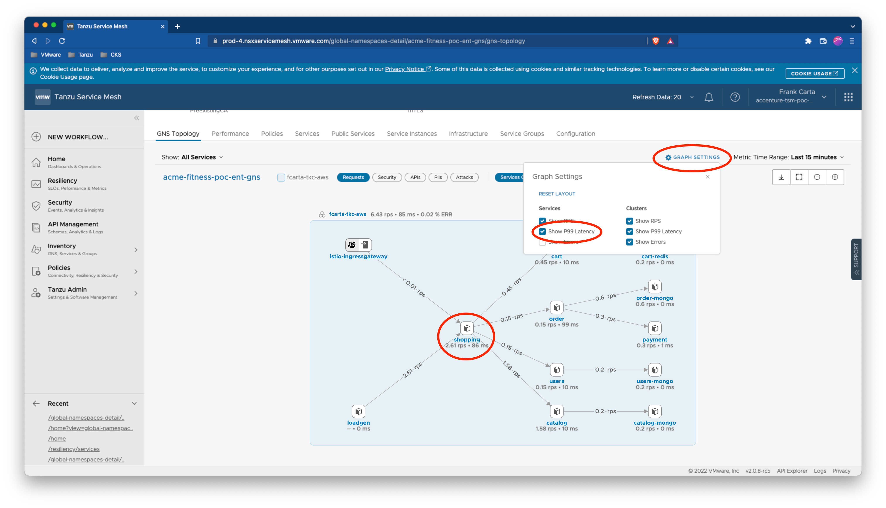
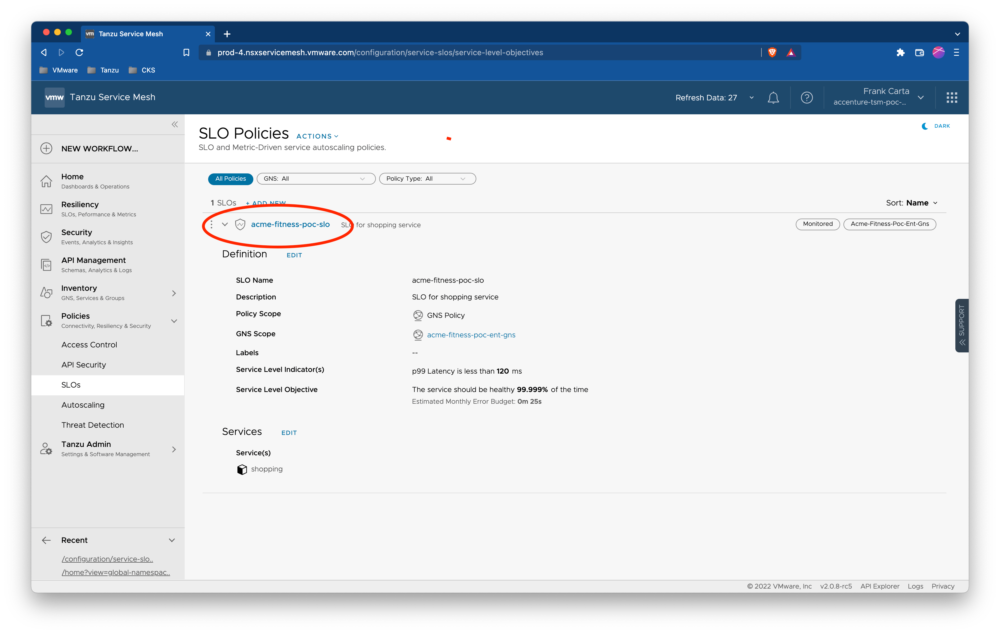
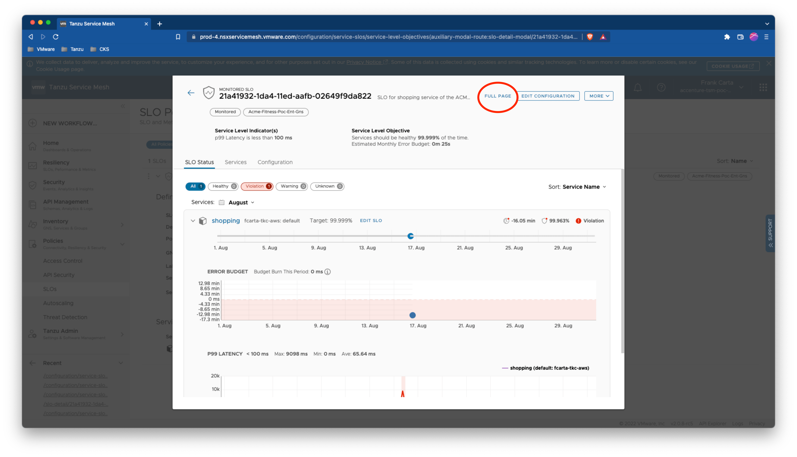
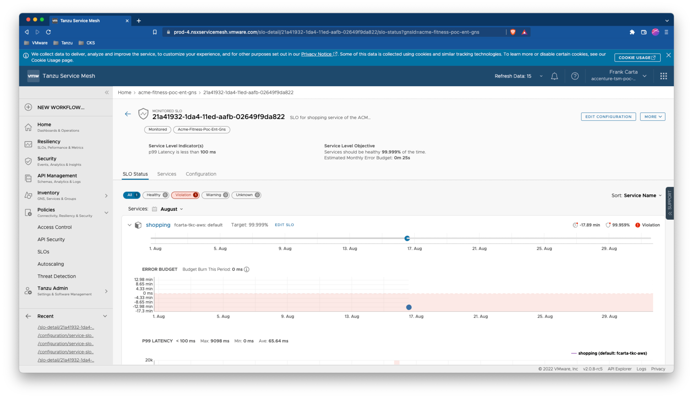
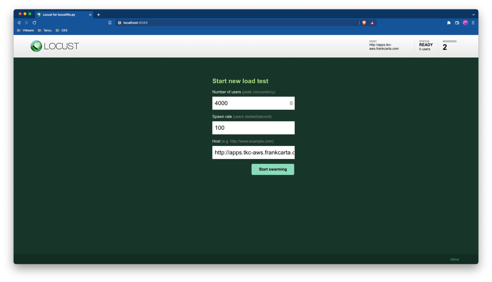
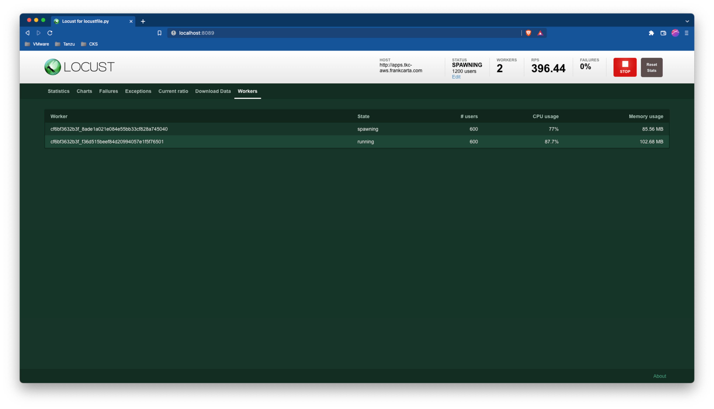
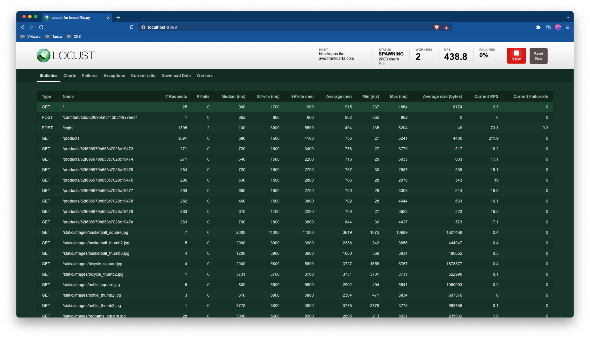
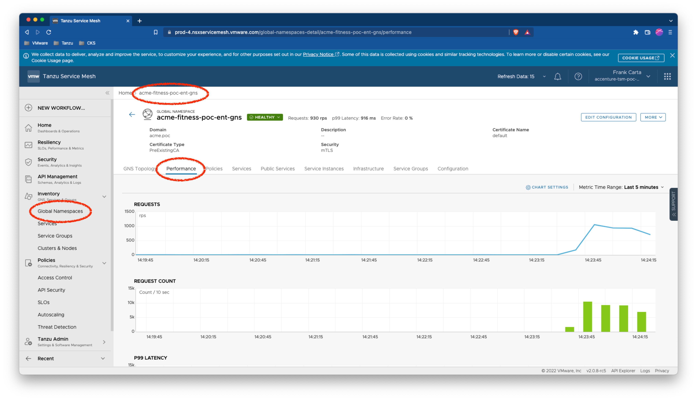
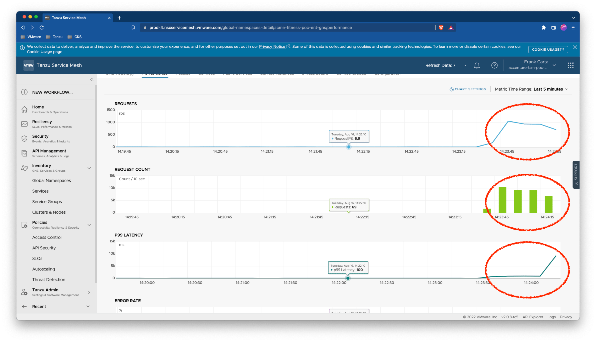
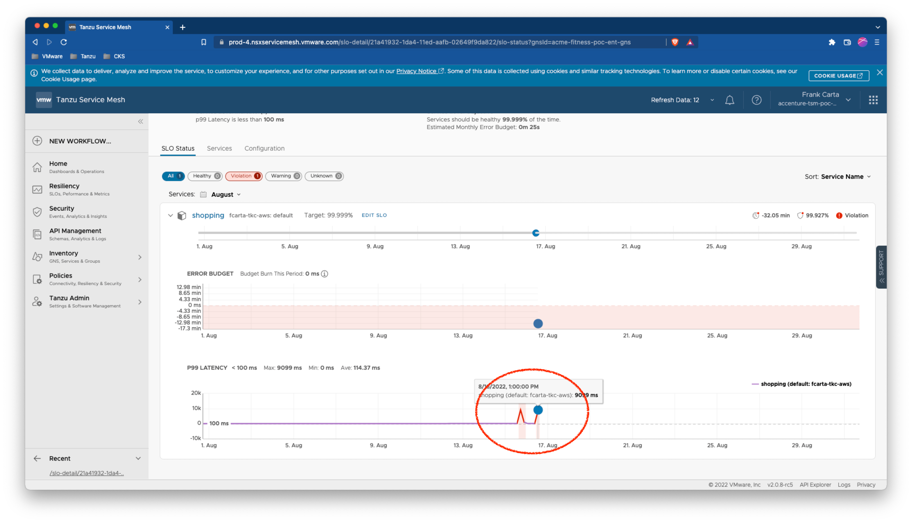

# SC06-TC02: Application Performance with Tanzu Service Mesh (TSM) - Creating Service Level Objectives (SLO) Using TSM REST API

This scenario captures how to create Service Level Objectives (SLO) and monitoring application performance against that set SLO target.

---

## Test Case Summary

This scenario test case creates a SLO via the TSM Rest API for the ACME Fitness Application to monitor and capture violations of the SLO during load.

---

## Useful documentation

* VMware Cloud Portal Auth/Token Flow for API calls [VMware Cloud Portal Auth/Token Flow for API calls](https://docs.vmware.com/en/vRealize-Operations/Cloud/com.vmware.vcom.api.doc/GUID-57E59E35-6C08-4424-A77F-468FACD35C41.html)
* Generating an API Token to Interact with VMware Cloud Service APIs [Generating an API Token to Interact with VMware Cloud Service APIs](https://docs.vmware.com/en/VMware-Cloud-services/services/Using-VMware-Cloud-Services/GUID-E2A3B1C1-E9AD-4B00-A6B6-88D31FCDDF7C.html)
* Tanzu Service Mesh API [Tanzu Service Mesh API](https://docs.vmware.com/en/VMware-Tanzu-Service-Mesh/services/api-programming-guide/GUID-FED8E849-B3C3-49ED-9FDB-1317CFFF3141.html)
* Tanzu Service Mesh Service Level Objective (SLO) Overview [Tanzu Service Mesh SLO Overview](https://docs.vmware.com/en/VMware-Tanzu-Service-Mesh/services/slos-with-tsm/GUID-39CAB7F1-2425-43D4-953E-556A934976CE.html)

---

## Prerequisites

* Completion of TSM Console access [SC01-TC01](../sc01-environment-setup/sc01-tc01-validate-tsm-console.md)
* Completion of API Token Generation and Authentication to the CSP [SC01-TC03](../sc01-environment-setup/sc01-tc03-csp-api-authorization-api.md)
* For Kubernetes Cluster `${KUBERNETES_CLUSTER1}` completion of TSM Onboarding [SC02-TC01](../sc02-cluster-onboarding/sc02-tc01-onboard-tsm-ui.md) or [SC02-TC02](../sc02-cluster-onboarding/sc02-tc02-onboard-tmc.md) or [SC02-TC03](../sc02-cluster-onboarding/sc02-tc03-onboard-tsm-api.md)
* Completion of ACME Fitness Application Deployment [SC03-TC01](../sc03-application-deployment/sc03-tc01-acme-fitness-application.md)
* Completion of GNS Creation [SC03-TC02](../sc03-application-deployment/sc03-tc02-acme-fitness-gns-ui.md) or [SC03-TC03](../sc03-application-deployment/sc03-tc03-acme-fitness-gns-api.md)

---

## Test Procedure

This test procedure assumes that the full ACME Fitness Application was deployed to the Kubernetes Cluster `${KUBERNETES_CLUSTER1}`.

1. If needed renew your Authentication to the CSP [SC01-TC03](../sc01-environment-setup/sc01-tc03-csp-api-authorization-api.md)

    ```execute
    export CSP_AUTH_TOKEN=$(curl -k -X POST "https://console.cloud.vmware.com/csp/gateway/am/api/auth/api-tokens/authorize" -H "accept: application/json" -H "Content-Type: application/x-www-form-urlencoded" -d "refresh_token=${CSP_API_TOKEN}" | jq -r '.access_token')
    ```

2. Ensure no previous SLOs exist for the `shopping` service first.

    ```bash
    curl -k -X GET "https://${TSM_SERVER_NAME}/tsm/v1alpha1/global-namespaces/${TSM_GLOBALNAMESPACE_NAME}/service-level-objectives" -H "csp-auth-token:${CSP_AUTH_TOKEN}" | jq .
    ```

    Expected (If no previous SLO exists):

    ```json
    []
    ```

3. Optional: If desired, here is how you can delete a SLO.

    ```bash
    curl -k -X DELETE "https://${TSM_SERVER_NAME}/tsm/v1alpha1/global-namespaces/${TSM_GLOBALNAMESPACE_NAME}/service-level-objectives/${TSM_CATALOG_SLO_NAME}" -H "csp-auth-token:${CSP_AUTH_TOKEN}" | jq .
    ```

    Response:

    ```json
    {
        "status": "${TSM_CATALOG_SLO_NAME} with gnsId ${TSM_GLOBALNAMESPACE_NAME} deleted"
    }
    ```

4. Create a monitored SLO for the `shopping` service.

    > **_NOTE:_**  The example below defines a latency for the `shopping` service at a P99 latency of `100ms` and this value may differ on your environment. Observe a baseline P99 latency for the `shopping` service and chose a value slightly above for your SLO value.

    

    ```bash
    curl -k -X POST "https://${TSM_SERVER_NAME}/tsm/v1alpha1/global-namespaces/${TSM_GLOBALNAMESPACE_NAME}/service-level-objectives" -H "csp-auth-token:${CSP_AUTH_TOKEN}" -H "Content-Type: application/json" -d '
    {
        "type": "MONITORED",
        "description": "SLO for shopping service of the ACME Fitness App",
        "labels": [],
        "basic_options": [{
            "metricName": "p99LATENCY",
            "value": 100
        }],
        "slo_target_value": 99.999,
        "slo_period": {
            "slo_period_frequency": "MONTHLY"
        },
        "services": [{
            "name": "shopping"
        }]
    }' | jq .
    ```

    Expected:

    ```json
    {
        "type": "MONITORED",
        "description": "SLO for shopping service of the ACME Fitness App",
        "labels": [],
        "basic_options": [
            {
            "metricName": "p99LATENCY",
            "value": 100
            }
        ],
        "slo_target_value": 99.9990005493164,
        "slo_period": {
            "slo_period_frequency": "MONTHLY"
        },
        "slo_actions": [],
        "services": [
            {
            "name": "shopping"
            }
        ],
        "id": "21a41932-1da4-11ed-aafb-02649f9da822",
        "creationTime": "2022-08-16T20:43:49.492Z"
    }
    ```

    > **_NOTE:_**  Currently via the TSM REST API you cannot set the name like you can via the TSM UI. The display name in the TSM UI will be the `id` field.

5. Validate in TSM UI SLO is created by navigating on the left side menu to `Policies > SLOs`. To view the SLO metrics click on the name (or UUID of the previously created SLO).

    Expected:

    

    A dialog window showing the details of the SLO will popup.

    

    From the SLO dialog click on the `Full Page` link to get the SLO status page.

    

6. Generate traffic to the ACME Fitness Application to violate the newly created SLO from previous steps. Fire up the locust traffic generator application using the given locust file `/scenarios/files/acme-fitness-app/loadgen/locustfile.py` supplied with this project. Its best to start locust in distributed mode with 2 workers. If working from the supplied Management container, to start up locust in distributed worker mode with 2 workers, you can run the following in seperate windows/tabs:

    master

    ```bash
    locust --host=<http://${ACME_FITNESS_FQDN>} -f /scenarios/files/acme-fitness-app/loadgen/locustfile.py --master
    ```

    workers (x2)

    ```bash
    locust --host=http://${ACME_FITNESS_FQDN} -f /scenarios/files/acme-fitness-app/loadgen/locustfile.py --worker
    ```

    Expected (master):<pre>
    [2022-08-16 21:18:52,182] cf6bf3632b3f/INFO/locust.main: Starting web interface at <http://0.0.0.0:8089> (accepting connections from all network interfaces)
    [2022-08-16 21:18:52,202] cf6bf3632b3f/INFO/locust.main: Starting Locust 2.8.6
    [2022-08-16 21:19:05,765] cf6bf3632b3f/INFO/locust.runners: Client 'cf6bf3632b3f_f36d515beef84d20994057e1f5f76501' reported as ready. Currently 1 clients ready to swarm.
    [2022-08-16 21:19:19,207] cf6bf3632b3f/INFO/locust.runners: Client 'cf6bf3632b3f_8ade1a021e084e55bb33cf828a745040' reported as ready. Currently 2 clients ready to swarm.</pre>

    Expected (workers x2):<pre>
    [2022-08-16 21:19:05,762] cf6bf3632b3f/INFO/locust.main: Starting Locust 2.8.6
    </pre>


7. Open Browser to locust running on `http://localhost:8089` and configure it with enough users to raise the ACME Fitness application latency for the `shopping` service above `100ms`.

    > **_NOTE:_**  Depending on your testing environment SLO latency and user count may differ a bit. You may have to alter them a bit to generate a SLO violation.

    

    

    

8. After about a minute of load generation from the previous step, navigate to the GNS performance metrics via the TSM UI. Scroll down to the `P99 Latency` metric and observe the rise in wait time for the `shopping` service as the number of requests increases.

    

    Expected:

    

9. In the TSM UI navigate back to the `SLO Status` page and view the SLO violation for `P99 Latency` of the shopping service.

    

    Expected:

    

---

## Status Pass/Fail

* [  ] Pass
* [  ] Fail

Return to [Test Cases Inventory](../../README.md#test-cases-inventory)
