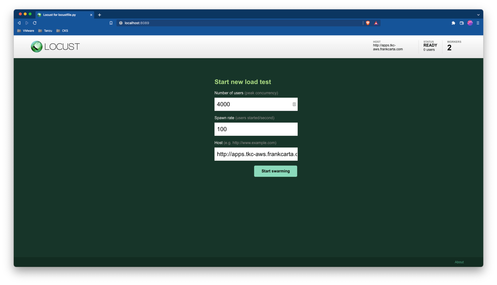
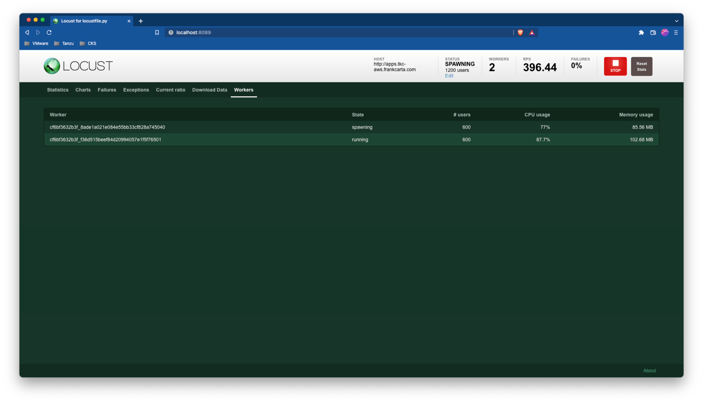

# SC06-TC03: Application Performance with Tanzu Service Mesh (TSM) - Creating Autoscaling Policies Using TSM REST API

This scenario captures how to create Autoscaling Policies via TSM Rest API that trigger service scaling when Service Level Indicators (SLIs) are violated.

---

## Test Case Summary

This scenario test case creates an Autoscaling Policy for the ACME Fitness Application `shopping` service. TODO[fcarta] - define SLI and how to trigger

---

## Useful documentation

* Tanzu Service Mesh API [Tanzu Service Mesh API](https://docs.vmware.com/en/VMware-Tanzu-Service-Mesh/services/api-programming-guide/GUID-FED8E849-B3C3-49ED-9FDB-1317CFFF3141.html)
* Tanzu Service Mesh Autoscaling Overview [Tanzu Service Mesh Autoscaling Overview](https://docs.vmware.com/en/VMware-Tanzu-Service-Mesh/services/service-autoscaling-with-tsm-user-guide/GUID-055BCF57-8349-4954-AB0F-C1C487583902.html)

---

## Prerequisites

* Completion of TSM Console access [SC01-TC01](../sc01-environment-setup/sc01-tc01-validate-tsm-console.md)
* Completion of API Token Generation and Authentication to the CSP [SC01-TC03](../sc01-environment-setup/sc01-tc03-csp-api-authorization-api.md)
* For Kubernetes Cluster `${KUBERNETES_CLUSTER1}` completion of TSM Onboarding [SC02-TC01](../sc02-cluster-onboarding/sc02-tc01-onboard-tsm-ui.md) or [SC02-TC02](../sc02-cluster-onboarding/sc02-tc02-onboard-tmc.md) or [SC02-TC03](../sc02-cluster-onboarding/sc02-tc03-onboard-tsm-api.md)
* Completion of ACME Fitness Application Deployment [SC03-TC01](../sc03-application-deployment/sc03-tc01-acme-fitness-application.md)
* Completion of GNS Creation [SC03-TC02](../sc03-application-deployment/sc03-tc02-acme-fitness-gns-ui.md) or [SC03-TC03](../sc03-application-deployment/sc03-tc03-acme-fitness-gns-api.md)

---

## Test Procedure

This test procedure assumes that the full ACME Fitness Application was deployed to the Kubernetes Cluster `${KUBERNETES_CLUSTER1}`.

1. If needed renew your Authentication to the CSP [SC01-TC03](../sc01-environment-setup/sc01-tc03-csp-api-authorization-api.md)

    ```execute
    export CSP_AUTH_TOKEN=$(curl -k -X POST "https://console.cloud.vmware.com/csp/gateway/am/api/auth/api-tokens/authorize" -H "accept: application/json" -H "Content-Type: application/x-www-form-urlencoded" -d "refresh_token=${CSP_API_TOKEN}" | jq -r '.access_token')
    ```

2. Ensure no previous Autoscaling Policies exist for the `shopping` service first.

    ```bash
    curl -k -X GET "https://${TSM_SERVER_NAME}/tsm/v1alpha1/global-namespaces/${TSM_GLOBALNAMESPACE_NAME}/service-level-objectives" -H "csp-auth-token:${CSP_AUTH_TOKEN}" | jq .
    ```

    Expected (If no previous Autoscaling Policy exists):

    ```json
    []
    ```

3. Optional: If desired, here is how you can delete an Autoscaling Policy.

    ```bash
    curl -k -X DELETE "https://${TSM_SERVER_NAME}/tsm/v1alpha1/global-namespaces/${TSM_GLOBALNAMESPACE_NAME}/autoscaling-policies/${TSM_AUTOSCALING_NAME}" -H "csp-auth-token:${CSP_AUTH_TOKEN}" | jq .
    ```

    Response:

    ```json
    {
        "status": "Autoscaling Policy:${TSM_AUTOSCALING_NAME} in GNS:${TSM_GLOBALNAMESPACE_NAME} deleted"
    }
    ```

4. Create an Autoscaling Policy for the `shopping` service.

    > **_NOTE:_**  The example below defines a CPU thresholds for the `shopping` that may vary in your environment at rest and under load. Find the `shopping` service baseline CPU under light and heavy loads to determine appropriate range to trigger autoscaling.

    ```bash
    curl -k -X PUT "https://${TSM_SERVER_NAME}/tsm/v1alpha1/global-namespaces/${TSM_GLOBALNAMESPACE_NAME}/autoscaling-policies/${TSM_AUTOSCALING_NAME}" -H "csp-auth-token:${CSP_AUTH_TOKEN}" -H "Content-Type: application/json" -d '
    {
        "description": "Autoscaling for shopping service",
        "labels": [],
        "mode": "EFFICIENCY",
        "service_name": "shopping",
        "service_version_name": "shopping",
        "enabled": true,
        "min_instances": 1,
        "max_instances": 2,
        "scaling_method": {},
        "default_instances": 1,
        "leading_metrics_indicator": {
            "metric_name": "CPUUsageMillicores",
            "scale_up_threshold": 400,
            "scale_down_threshold": 100,
            "window_seconds": 60
        },
        "grace_period_seconds": 60
    }' | jq .
    ```

    Response:

    ```json
    {
        "description": "Autoscaling for shopping service",
        "mode": "EFFICIENCY",
        "service_name": "shopping",
        "service_version_name": "shopping",
        "enabled": true,
        "min_instances": 1,
        "max_instances": 2,
        "default_instances": 1,
        "scaling_method": {},
        "leading_metrics_indicator": {
            "metric_name": "CPUUsageMillicores",
            "scale_up_threshold": 400,
            "scale_down_threshold": 100,
            "window_seconds": 60
        },
        "grace_period_seconds": 60,
        "id": "acme-fitness-poc-autoscaling-policy"
    }
    ```

5. Validate in TSM UI the new Autoscaling Policy is created by navigating on the left side menu to `Policies > Autoscaling`.

    Expected:

    

6. Validate the Autoscaling Policy is displaying for the `shopping` service. First navigate to the `shopping` service dashboard by using the left side menu to `Inventory > Services` and clicking on the `shopping` service. From the `shopping` service dashboard select the `Performance` tab

    Expected:

    

    

7. Generate traffic to the ACME Fitness Application to trigger the newly created Autoscaling Policy from previous steps. Fire up a locust traffic generator application using the given locust file in `/scenarios/files/acme-fitness-app/loadgen/locustfile.py` supplied with this project. Its best to start locust in distributed mode with 2 workers. If working from the supplied Management container, to start up locust in distributed worker mode with 2 workers, you can run the following in seperate windows/tabs:

    master

    ```bash
    locust --host=<http://${ACME_FITNESS_FQDN>} -f /scenarios/files/acme-fitness-app/loadgen/locustfile.py --master
    ```

    workers (x2)

    ```bash
    locust --host=http://${ACME_FITNESS_FQDN} -f /scenarios/files/acme-fitness-app/loadgen/locustfile.py --worker
    ```

    Expected (master):<pre>
    [2022-08-16 21:18:52,182] cf6bf3632b3f/INFO/locust.main: Starting web interface at <http://0.0.0.0:8089> (accepting connections from all network interfaces)
    [2022-08-16 21:18:52,202] cf6bf3632b3f/INFO/locust.main: Starting Locust 2.8.6
    [2022-08-16 21:19:05,765] cf6bf3632b3f/INFO/locust.runners: Client 'cf6bf3632b3f_f36d515beef84d20994057e1f5f76501' reported as ready. Currently 1 clients ready to swarm.
    [2022-08-16 21:19:19,207] cf6bf3632b3f/INFO/locust.runners: Client 'cf6bf3632b3f_8ade1a021e084e55bb33cf828a745040' reported as ready. Currently 2 clients ready to swarm.</pre>

    Expected (workers x2):<pre>
    [2022-08-16 21:19:05,762] cf6bf3632b3f/INFO/locust.main: Starting Locust 2.8.6
    </pre>

8. Open Browser to locust running on `http://localhost:8089` and configure it with enough users to overwhelm the ACME Fitness application and drive up the CPU millicores for the `shopping` service above the configured thresholds for the Autoscale Policy.

    > **_NOTE:_**  Depending on your testing environment the CPU millicores values/thresholds and user count may differ a bit. You may have to alter them a bit to trigger autoscaling.

    

    

    

9. After a few minutes of load generation from the previous step, go back to the TSM UI and the `shopping` service's `Performance` dashboard. Validate that the `shopping` service CPU millicores increased with the rise in requests and as a result triggered an autoscaling event to upscale the `shopping` service to two(2) instances.

    > **_NOTE:_**  Its best to set the `Metric Time Range` to 5 or 10 minutes to easily see the autoscaling triggering.

    Expected:

    

10. After upscaling of the `shopping` service has been triggered by the Autoscale Policy shutdown traffic generation and validate that the `shopping` service CPU millicores decreases with the fall in requests and as a result triggered another autoscaling event to downscale the `shopping` service to one(1) instance.

    Expected:

    

---

## Status Pass/Fail

* [  ] Pass
* [  ] Fail

Return to [Test Cases Inventory](../../README.md#test-cases-inventory)
