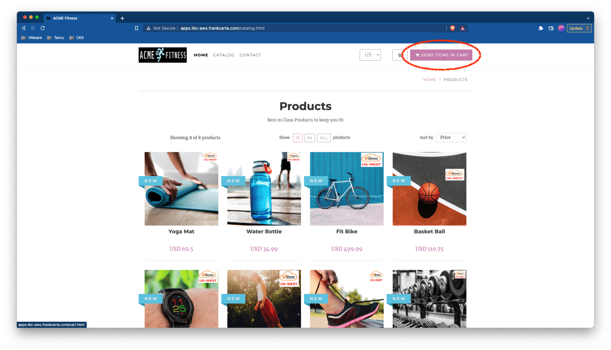

# SC07-TC01: Application Security with Tanzu Service Mesh (TSM) - Detecting services that transmit sensitive PII data Using TSM

This scenario captures how to detect and find applications services that transmit sensitive PII data.

---

## Test Case Summary

This scenario walks through how to make a fake ACME Fitness Application credit card transaction and then view the services that transmit sensitive PII data via the TSM UI.

---

## Useful documentation

* VMware Tanzu Service Mesh Concepts [VMware Tanzu Service Mesh Concepts](https://docs.vmware.com/en/VMware-Tanzu-Service-Mesh/services/concepts-guide/GUID-DEB57BAB-688F-4A4D-81E8-9CECC0F80FD5.html)

---

## Prerequisites

* Completion of TSM Console access [SC01-TC01](../sc01-environment-setup/sc01-tc01-validate-tsm-console.md)
* For Kubernetes Cluster `${KUBERNETES_CLUSTER1}` completion of TSM Onboarding [SC02-TC01](../sc02-cluster-onboarding/sc02-tc01-onboard-tsm-ui.md) or [SC02-TC02](../sc02-cluster-onboarding/sc02-tc02-onboard-tmc.md) or [SC02-TC03](../sc02-cluster-onboarding/sc02-tc03-onboard-tsm-api.md)
* Completion of ACME Fitness Application Deployment [SC03-TC01](../sc03-application-deployment/sc03-tc01-acme-fitness-application.md)
* Completion of GNS Creation [SC03-TC02](../sc03-application-deployment/sc03-tc02-acme-fitness-gns-ui.md) or [SC03-TC03](../sc03-application-deployment/sc03-tc03-acme-fitness-gns-api.md)

---

## Test Procedure

This test procedure assumes that the full ACME Fitness Application was deployed to the Kubernetes Cluster `${KUBERNETES_CLUSTER1}`.

1. If not already done add some items to the shopping cart by navigating to the products in the `Catalog`.

    Expected:

    

    

2. Select the shopping cart and proceed with checkout.

    Expected:

    

    

3. Enter sample address data and continue to delivery method.

    Expected:

    

4. Select the only delivery method (Tractors are very slow) and contiue to payment method.

    Expected:

    

5. Using a testing [credit card](https://www.financegab.com/credit-card/test-card-numbers/) enter the payment method and continue to payment review.

    Expected:

    

6. Validate sample order data and place the order.

    Expected:

    

7. Confirm sample order succeeded.

    Expected:

    

8. Open up the Global Namespace Topology on the TSM UI and select the `PIIs` toggle button to display `PII` metrics. Validate that the sample order made in previous steps displays the services path traversed.

    Expected:

    

---

## Status Pass/Fail

* [  ] Pass
* [  ] Fail

Return to [Test Cases Inventory](../../README.md#test-cases-inventory)
