# SC07-TC02: Application Security with Tanzu Service Mesh (TSM) - Threat Detection Using TSM

This scenario captures how to detect hacking attempts to an application running on TSM.

---

## Test Case Summary

This scenario walks through how to create a `Threat Detection Policy` to capture hacking attempts to the ACME Fitness Application via the TSM UI.

---

## Useful documentation

* VMware Tanzu Service Mesh Concepts [VMware Tanzu Service Mesh Concepts](https://docs.vmware.com/en/VMware-Tanzu-Service-Mesh/services/concepts-guide/GUID-DEB57BAB-688F-4A4D-81E8-9CECC0F80FD5.html)

---

## Prerequisites

* Completion of TSM Console access [SC01-TC01](../sc01-environment-setup/sc01-tc01-validate-tsm-console.md)
* For Kubernetes Cluster `${KUBERNETES_CLUSTER1}` completion of TSM Onboarding [SC02-TC01](../sc02-cluster-onboarding/sc02-tc01-onboard-tsm-ui.md) or [SC02-TC02](../sc02-cluster-onboarding/sc02-tc02-onboard-tmc.md) or [SC02-TC03](../sc02-cluster-onboarding/sc02-tc03-onboard-tsm-api.md)
* Completion of ACME Fitness Application Deployment [SC03-TC01](../sc03-application-deployment/sc03-tc01-acme-fitness-application.md)
* Completion of GNS Creation [SC03-TC02](../sc03-application-deployment/sc03-tc02-acme-fitness-gns-ui.md) or [SC03-TC03](../sc03-application-deployment/sc03-tc03-acme-fitness-gns-api.md)

---

## Test Procedure

This test procedure assumes that the full ACME Fitness Application was deployed to the Kubernetes Cluster `${KUBERNETES_CLUSTER1}`.

1. On the TSM UI from the left menu select `Policy > Threat Detection` and click `NEW POLICY` to create a new `Threat Detection Policy`.

    Expected:

    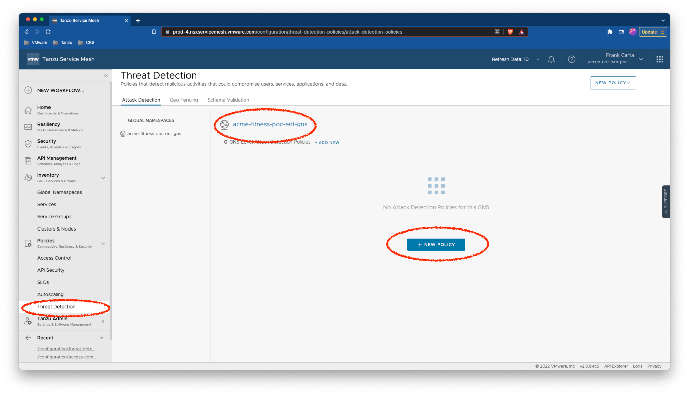

2. On the `New Attack Detection Policy` dialog enter a policy name and select the previously created Global Namespace (GNS). Make sure the `SQL INJECTION` request attack is selected and click `NEXT`.

    Expected:

    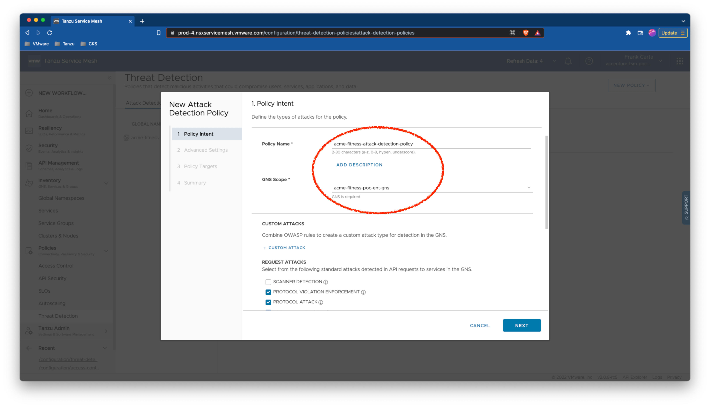

    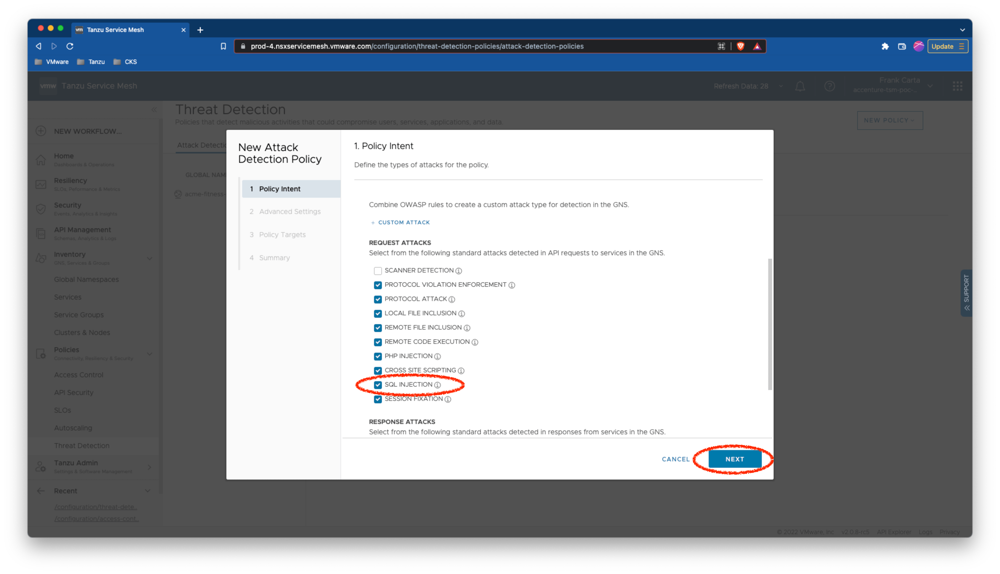

3. Use the default selection `Level 1 (Low)` for the advanced settings and select `NEXT`.

    Expected:

    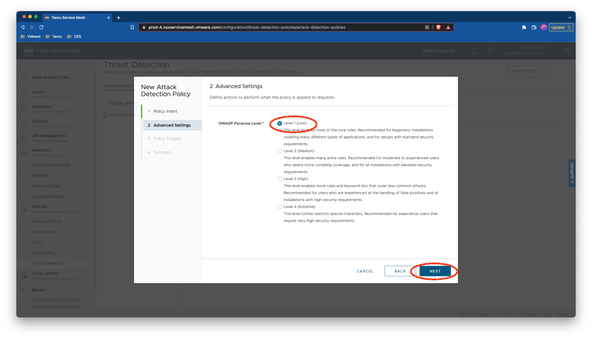

4. For policy targets keep the default `All Services in the GNS` and select `NEXT`.

    Expected:

    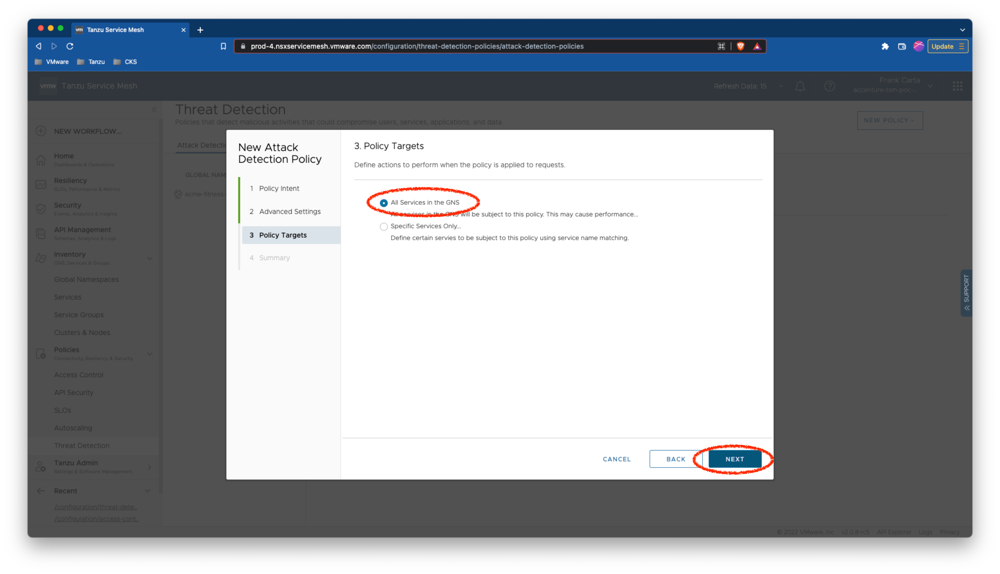

5. Validate the data entered for the `Threat Detection Policy` and click `SAVE` to create it.

    Expected:

    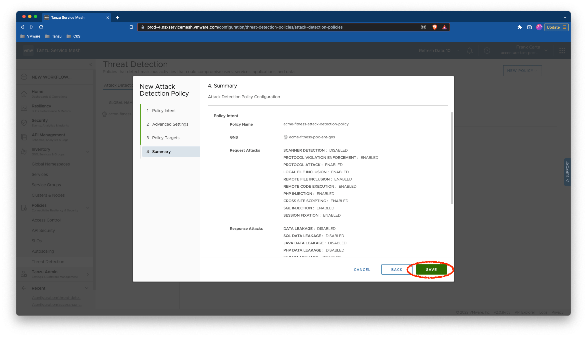

6. Confirm the `Threat Detection Policy` was created.

    Expected:

    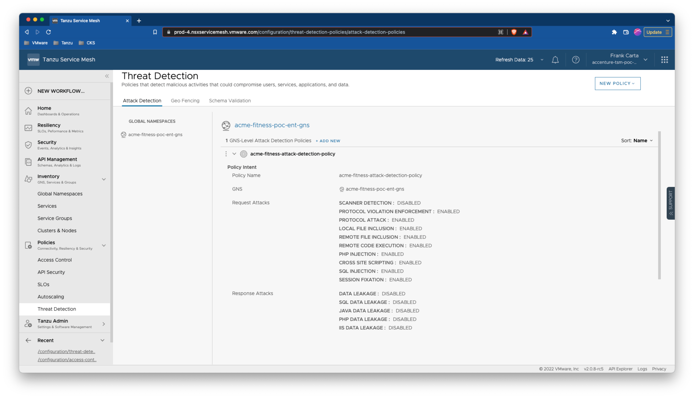

7. From a browser go to your deployed ACME Fitness Application and paste the following `SQL Injection` script that will attack the `catalog` service product page.

    ```bash
    http://${ACME_FITNESS_FQDN}/products?id=productId%22%20UNION%[%E2%80%A6]20database(),2,3,4,5,6,7%20--+
    ```

    Expected:

    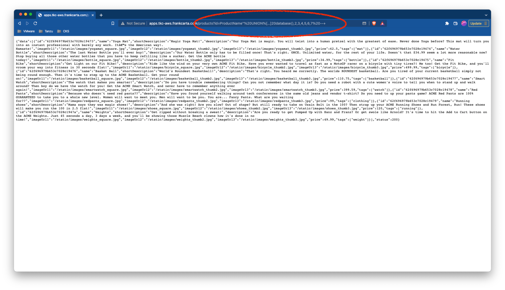

8. Back in the TSM UI navigate back to the GNS Topology `Inventory > Global Namespace` and toggle the `Attacks` button to display the `SQL Inejection` attack.

    Expected:

    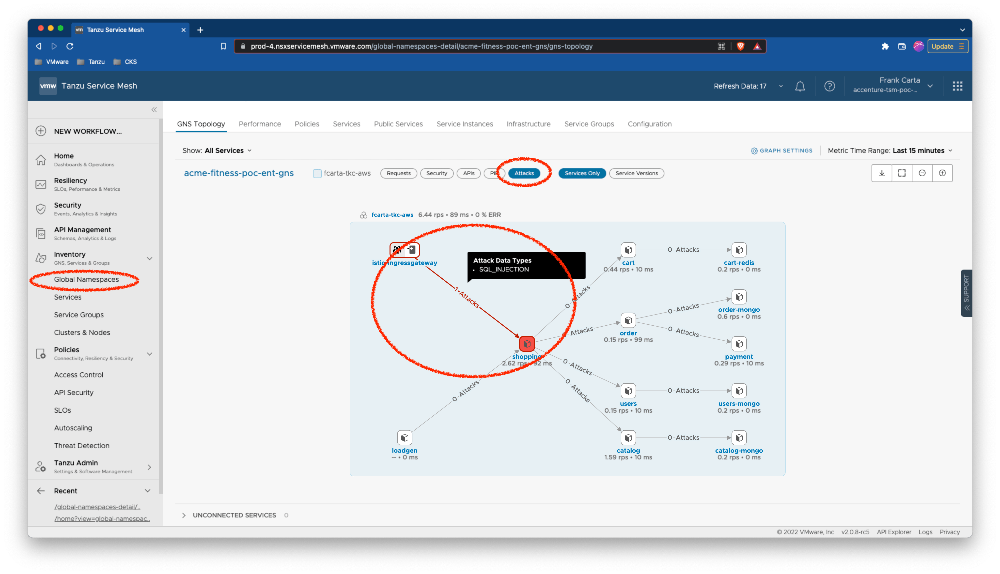

9. Validate that the `SQL Injection` attack was also captured under the `Security > Security Events` dashboards and that details of the event are accessible.

    Expected:

    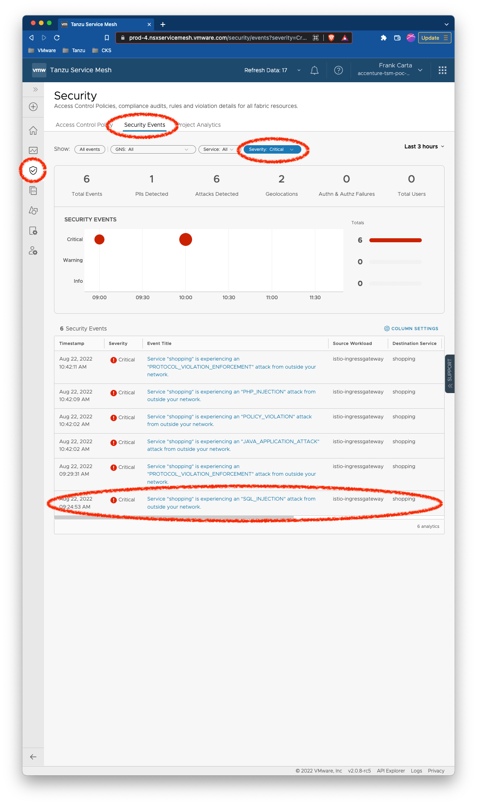

    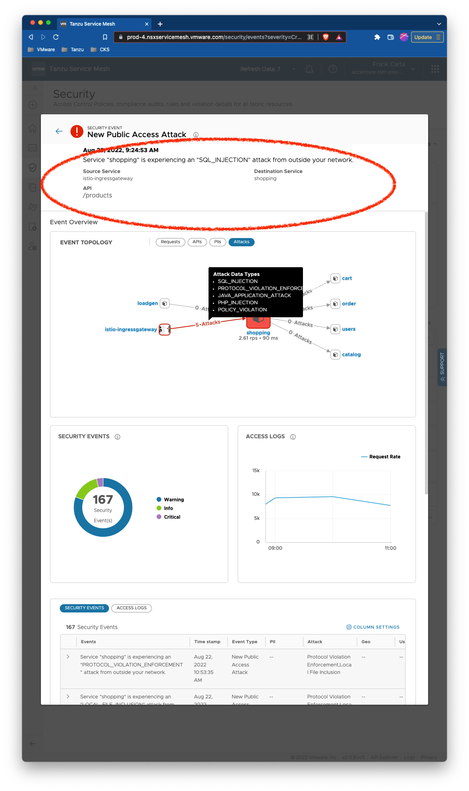

---

## Status Pass/Fail

* [  ] Pass
* [  ] Fail

Return to [Test Cases Inventory](../../README.md#test-cases-inventory)
